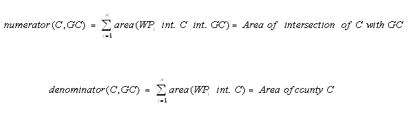

Spatial Allocator v4.3 User's Guide

------------

Chapter 3. Vector Tools
===
<a id="intro1"><a/>
1. Background
----------
1.1  Introduction
----------

The SA Vector Tools consist of seven programs to generate spatial surrogates, convert shapefiles from one map projection to another, filter (or select) shapefiles, merge surrogates, perform gap-filling of surrogates, and map data from one spatial resolution to another (e.g., from grids to counties).. The first three programs listed below are primary programs, while the other three are utility programs used for data file comparison and format conversions.

-   The allocator program (***allocator.exe***) performs spatial computations such as filtering, overlays, map projection conversion, and conversion of data from one spatial form to another. For example, the allocator.exe can be used to map point source data to modeling grid cells or polygons, aggregate data for county polygons into state polygons, convert data from one grid to another, or create a new shapefile by specifying a filter based on any attributes of an existing shapefile.
-   The surrogate creator program (***srgcreate.exe***) generates surrogates for point-, line-, or polygon-based weight shapefiles such as ports, airports, housing, population, agriculture, water area, and railroads. The surrogate creator tool can generate surrogates for regularly spaced air quality model grids, the WRF/NMM-CMAQ E-grids(rotated diamond shaped grids), or any modeling polygon shapes (such as census tracts) on a variety of map projections, such as Universal Transverse Mercator (UTM), Lambert Conformal, and latitude-longitude. It supports a variety of standard and user-specified ellipsoids to approximate the shape of the Earth.
-   The BELD3 converter program (***beld3smk.exe***) converts 1-km gridded landuse data to a user-specified modeling grid, egrid, or polygons. The output of this program can be used as input to the Normbeis3 program in the SMOKE emissions model.
-   The BELD4 converter program (***beld4smk.exe***) converts 1-km gridded landuse data to a user-specified modeling grid, egrid, or polygons. The output of this program can be used as input to the Normbeis3 program in the SMOKE emissions model.
-   The ***diffsurr.exe*** utility compares the values of two surrogates.
-   The ***diffioapi.exe*** utility compares two I/O API files, checking that the files' headers and data values are consistent.
-   The ***dbf2asc.exe*** utility produces an ASCII (csv) file from the DBF portion of a shapefile.

In addition, five Java-based tools for generating and processing spatial surrogates are available in the SurrogateTools.jar file. The tools provide a more user-friendly way of computing surrogates using the SA Vector Tools, i.e. srgcreate.exe. The Surrogate Tools clarify how the surrogates are generated, and do not require the user to perform extensive scripting. They use comma-separated values (CVS) configuration files to (a) compute surrogates from shapefiles, (b) to merge together existing surrogate data, (c) and/or to gapfil surrogates using data from other surrogates to ensure that entries are available for every single county. (d) In addition, tools are included that provide quality assurance summary capabilities for all computed surrogates, (e) along with a surrogate normalization program that can ensure that surrogates for every county sum to 1.0 (except some counties on border, can be excluded). The Surrogate Tools require Java 1.5 version or later.

1.2 Project Objectives
----------

The following were the objectives of the Spatial Allocator development projects:

1.  Develop software that (a) reads geospatial data (polygons, lines, and points with attributes that serve as weights in latitude-longitude or projected coordinates) and a description of target polygons (possibly on a different map projection and Earth ellipsoid); (b) allocates the input data to the target polygons based on weighted spatial overlap of the input data and target polygons; and (c) outputs the results (e.g., to generate surrogates to be used as inputs to the Sparse Matrix Operator Kernel Emissions [SMOKE] modeling system)
     
2.  Develop a machine-independent Java surrogate tools which calls the Spatial Allocator Vector Tool utilities internally without script files for users to compute one or more surrogates in a single run based on simple csv and text input files and summarize the computed surrogates for quality assurance.
     
3.  Demonstrate the use of the spatial allocation software to prepare surface water cover, railroads, airports, and housing type information for use by SMOKE (i.e., surrogates).
     
1.3 Credits
----------

The Vector Tools component of the MIMS Spatial Allocator was developed by members of the Institute for the Environment at the University of North Carolina at Chapel Hill (<http://www.ie.unc.edu/>), some of whom were formerly associated with MCNC. The development and continued maintenance of this software has been sponsored by the EPA Office of Research and Development. The first version of the Spatial Allocator software was developed in 2002-2003 to provide a tool for performing emission surrogate generation and other types of spatial allocation without requiring users to have a GIS. Initial releases of the software took place in March 2003 and December 2003. A project to update the tool with new features was sponsored in 2004-2005, with a first release of the updated tool in January 2005 and another release in April 2006. A training class was developed in Dec. 2008, with funding from the U.S. EPA. A complete history of revisions is available at chapter 8.

This document includes instructions for the current release of the software and serves as a user's guide for the Vector Tools component of the Spatial Allocator.  

<a id="background2"><a/>
2. Background on Shapefiles and Surrogates
------------------------------------------

### 2.1 Shapefiles

Shapefiles contain geographic data objects in the forms of points, lines, or polygons with associated informational attributes that describe the geometric features. Shapefiles are a GIS industry standard format developed by the Environmental Systems Research Institute (ESRI) (see <http://www.esri.com/>). Shapefiles contain geospatial vector data and are the primary type of input data for the SA Vector Tools.

Each shapefile stores data for a single feature class (i.e., a shapefile contains information for points, lines, or polygons). Point shapes are single-coordinate features such as smoke stacks, schools, or ports. Line shapes can be continuous lines, such as roads, and they can also be polylines, like the branches or tributaries of a river. Polygon shapes can be simple areas or multipart areas like states and countries (e.g., the state of Michigan is a multipart shape). Shapefiles do not store topological information in that they do not contain associations between points, lines and polygons.

A shapefile consists of a group of files that contain the coordinates of the shapes, associated attributes, and optionally, map projection information. Each shapefile contains three mandatory files:

-       .shp – coordinates of shapes or features (points, lines, or polygons)

-        .shx – shape positional index data, to support quickly searching through the data contained in the shapefile

-       .dbf – attribute data (e.g., population counts, road classes, airport capacities) for each shape in dBASE III format.

A shapefile can also contain many optional files, the details of which are not important to this discussion.

### 2.2 Spatial Surrogates

Spatial surrogates are most commonly used to map county-level emissions data onto the rectangular grid cells used by an Eulerian air quality model such as the Community Multiscale Air Quality (CMAQ) modeling system (see [www.cmascenter.org](http://www.cmascenter.org)). A spatial surrogate is a value greater than zero and less than or equal to one that specifies the fraction of the emissions in an area (usually a county) that should be allocated to a particular model grid cell. Many types of emission inventories contain data summed by county. Because the area of a given county may fall into several model grid cells, spatial surrogates must be used to indicate the fraction of the emissions for that county that is to be assigned to each grid cell that overlaps the county. Currently, EPA uses about 65 different types of surrogates that are computed from about 24 different shapefiles. Spatial surrogates typically must be computed for each grid to be modeled, unless the grid used is a fully aligned subset of a grid for which spatial surrogates are already available.

When surrogates are created, usually there is some type of geographic attribute that is used to "weight" the county emissions into grid cells in a manner that is more specific than a simple uniform spread over the county, which would not reflect the differences in emissions between cities, rural areas, ports, etc. For example, weights could be information about points that represent ports (e.g., berths); or the vehicle miles traveled on lines representing the locations of roads or railroads; or polygon-based weight attributes such as geographic area, population, number of households and land use categories. You can create spatial surrogates with the Spatial Allocator from point-, line-, or polygon-based shapefiles that contain weight attribute information. A single surrogate (srg) value for county C and grid cell GC is expressed as:


where srg = surrogate, C = county, and GC = grid cell. Note that a surrogate does not have to be for a county; it could be for some other geographic region such as a state, province, nation, or census tract. These polygons are known in the program as the "data polygons."

Three types of surrogates can be created with this program: polygon-based, line-based, and point-based. Polygon-based surrogates use attribute information that is based on area (e.g., population in a census tract). The surrogate value is calculated as the ratio of the attribute value in the intersection of the county and the grid cell to the total value of the attribute in a specific "data polygon" (e.g., county, state, census tract). Examples of polygon-based weight attributes are area, population, number of households, and land use. The numerator (i.e., the value of the weight attribute in the intersection of the county C and grid cell GC) and the denominator (i.e., the total attribute value in the county or other data polygon) are calculated according to the following equations:


where srg=surrogate, C = county (or other data polygon), GC = grid cell, WP = weight polygon, int. = intersection of, i = weight polygon, and n = the number of weight polygons.

For line-based surrogates, the length of the linear weight feature (e.g., railroad, river, road) replaces area in the above equations. For point-based surrogates, instead of using area, the software will allocate a value of 1 if the weight point falls within the region of interest or a value of 0 (zero) if it does not. In some cases, no special weight attribute is desired. Instead, the surrogate is based purely on the area of the polygon, the length of the polyline, or the count of the points. This mode is supported by the Spatial Allocator. In this case, the above equations simplify to the following:



<a id="installing31"><a/>
3. Using the software
------------------------------
3.1. Download and Installation
------------------------------

To download and install the Spatial Allocator, perform the following steps:

1.  The Spatial Allocator (set of Vector, Raster and Surrogate Tools) is available for download from the [CMAS Center website](http://www.cmascenter.org)
2.  On the left-hand side of the website, in the Download Center panel, click on MODEL
3.  Log in using an existing CMAS account, or create a new CMAS account.
4.  Use the pull-down list to select Spatial Allocator as the model you wish to download, then click submit.
5.  Specify the type of computer you are planning to run the Spatial Allocator as Linux.
6.  In the table that appears, follow the links to the gzipped tar archive for Linux, download this file into a directory with at least 1GB of available disk space (with all open source packages and required and some sample data).
7.  Downloaded the sa_v4.3_012017.tar.gz download file from the CMAS website do the following:
 -      tar -xzvf sa_v4.3_012017.tar.gz
 -      The directory sa_v4.3_012017 is referred to as the SA_HOME variable in bin/sa_setup.csh
 -      Test scripts and some test data are included in $SA_HOME\data\ directory
9.  For additional input data, check the EPA site <https://www.epa.gov/chief>. The Spatial section has data used to create surrogates, and the Biogenic section <https://www.epa.gov/air-emissions-modeling/biogenic-emission-sources> has data used to create SMOKE biogenic-related input files.'

<a id="userEnv32"><a/>
3.2. Setting up the User Environment
----------

All information needed by the programs is provided through environment variables.

Open source libraries are specified in bin/sa_setup.csh file. If users change the installtion directories for those rquired open source libraries, contents of this file and Makefile paths have to be changed accordingly.

Specifying Grids and Map Projections

<a id="scriptsTest33"><a/>
3.3. Runing the Test Cases for Using Scripts
--------------------------------------------

Scripts are provided for Unix users to exercise most of the major functions of the software. If you cd into the scripts directory, all of the scripts should run without any editing. However, if you wish to run any of the scripts without first cd-ing into the scripts directory, edit the SA_HOME setting for all of the scripts in the directory (e.g., ***generate_surrogates.csh***, ***compare_surrogates.csh***) to specify the full path to your installation folder.

A set of example scripts is provided with the software to assist users with getting started using the system. **These example scripts are provided only to serve as examples - the user is responsible for providing actual input data for his/her application and customizing the scripts accordingly.** The example scripts generate a set of surrogates for an 8-km grid over Nashville, Tennessee. These files were derived from files available from the EPA <ftp://ftp.epa.gov/EmisInventory/emiss_shp2003/>. Some of the files are used as is, while others are extracted for Tennessee from the larger national data sets due to their size. The only file that was not from this web site is the cnty_tn shapefile that contains the polygons for the counties of Tennessee. This file was obtained from an independent source of county data.

The following surrogates are generated in the examples:

1.  Airports
2.  Land Area
3.  Ports
4.  Navigable Water
5.  Major Highways
6.  Housing
7.  Population

**NOTE that these are examples only and should not be considered a complete set of surrogates with which to do emissions modeling!** However, a complete set of input files to reproduce EPA's 66 surrogates using the Surrogate Tool is available with the Surrogate Tool distribution.

The following are a few test scripts included in the release:

### Generate Emission Spatial Surrogates from Shapefiles and Compare to Reference Surrogates

1.  To test the basic operation of the surrogate creation program (i.e., generating surrogates for point, line, and polygon datasets), run the ***generate_surrogates.csh*** script. This will generate a set of test surrogates in the output directory, in addition to some gridded shapefiles that can be viewed in a GIS tool. Note that some warnings will be generated for counties on the edge of the grid since some of their surrogates will not sum to 1. 
      
2.  Run the ***compare_surrogates.csh script*** to compare your surrogates with the reference surrogates. Note that compare_surrogates uses the diffsurr.exe utility to compare two sets of surrogates with respect to a specified tolerance. **You may find the diffsurr.exe utility useful,** for example, when you are creating new surrogates and would like to compare them to the previous versions. Diffsurr takes its arguments from the command line. An example of its usage follows; note that 3 is the numeric ID for the surrogates in the two files (i.e., both surrogates are numbered 3 in this case), although that may not always be true.

            diffsurr.exe ../data/srg_nash_ref.txt 3 ../output/srg_M08_NASH.txt 3 0.00001

3.  **Examine the outputs of the program in the output directory.**
    -   The surrogate file (srg_M08_NASH.txt) includes comments preceded by a ! on each line that contains a surrogate fraction. Each comment shows the surrogate numerator and denominator that were used to compute the fraction, and a running sum of the surrogate fractions for that county. For counties entirely within the grid, the sum should be 1; for other counties, the sum should not exceed 1.
    -   Since the OUTPUT_FILE_NAME variable was specified for each surrogate created with the generate_surrogates script, shapefiles were created that contain the sum of the surrogate fraction numerators for each grid cell. The names of these files start with grid (e.g., grid_airpt_M08_NASH.shp), and they are in the map projection of the output grid. A corresponding .csv file is also created that just contains the row, column, and sum for the grid cell. There will be quite a few zeros in these files because only data for Tennessee was processed. For the airports surrogate, many additional grid cells will be zero because many cells do not contain airports.

### Generate a Filtered Surrogate

-   To see how to [generate a filtered surrogate](#filters73), run the ***filtered_surrogate.csh*** script. Examine the outputs that start with filtered_pop and filtered_srg in the output directory to see the files that it created. Also, to understand what filter was applied, examine the file filter_tn_pop.txt in the data directory. For additional examples of filters, look in the testsuite/filters directory.

### Generate a Surrogate Using a Weight Function

-   To see how to [generate a surrogate using a weight function](#surrogates4), run the ***weighted_surrogate.csh*** script. Examine the outputs that start with weighted_ in the output directory to see the files that it created. Also, to understand what weight was applied, look for the WEIGHT_FUNCTION line in the weighted_surrogates script. Also note that the ATTR_WEIGHT is set to USE_FUNCTION

### Change Map Projection of a Shapefile

1.  To see how to [change the map projection of a Shapefile](#converting6) using the **CONVERT_SHAPE** mode of the allocator program run the ***convert_input_shape.csh*** script as follows:

        convert_input_shape.csh ../data/tn_ports ../output/tn_ports_ll

    The new tn_ports_ll file will have coordinates in a latitude-longitude map projection. The tn_ports_ll file should be easily visualizable by GIS tools. Note that the ports gridded shapefile will not have a nonzero value in each grid cell that has a port because BERTHS was used as the weight and many ports in the weight file have a value of 0 for the BERTHS attribute. To make all grid cells with ports nonzero, use NONE as the value for the WEIGHT_ATTR_LIST when creating the ports surrogate.

2.  (Optional) If you require a mapping tool for shapefiles (e.g., for quality assurance of surrogates), you may want to consider ArcExplorer by ESRI, which is downloadable for free from the ESRI web site (<http://www.esri.com>).
      

### Filter a Shapefile

-   To see how to [filter a shapefile](#filters73) using the FILTER_SHAPE mode of the allocator program, run the ***filter_shapefile.csh*** script. Examine the outputs that start with filtered_ in the output directory to see the files that it created. Also, to understand what filter was applied, examine the file county_filter.txt in the data directory.

### Convert Files

-   To convert any DBF file to a .csv file, go to the $SA_HOME/bin directory and type:

### Generate BELD3/BELD4 Data for Biogenic Emissions Processing and Compare Two I/O API Files

-   To see how to [create inputs to SMOKE biogenic emissions processing](#smokBioInputs5) run the script ***convert_beld3.csh***. This script runs the program **beld3smk.exe**. The BELD3 data for the Tennessee area is provided in the /data/beld directory. After running convert_beld3.csh, run the script **compare_beld3.csh**. This script runs the diffioapi utility to compare the outputs to a reference data set and confirm that the results are the same.

### Allocation data attributes from a grid, polygon, or point file to an output grid or polygon file

-   Examples of how to use the ALLOCATE and OVERLAY modes of the allocator program are given in the [General Spatial Allocation and Overlays](#alloc71) section.

<a id="envVars34"><a/>
3.4. Environment Variables Used by the Software
-----------------------------------------------

The main method for controlling the Spatial Allocator programs is through environment variables. This page is a reference page that describes all of the environment variables used by the programs srgcreate.exe and allocator.exe. (Note: not all variables are used in all circumstances) The active variables depend on the processing mode selected and the settings of the other options (e.g., grid name and a GRIDDESC file are not required unless you are using a grid as an input or output variable).

See Section 5.1:[Creating Inputs to SMOKE Biogenic Processing](#smokBioInputs5) for information on the environment variables used by beld3smk.exe and diffioapi.exe

### 3.4.1 Helper Variables Found in Scripts

The following environment variables are used to help locate files and directories in the example scripts, but they are not recognized by any of the Spatial Allocator programs:

-   SA_HOME - Installation directory
-   OUTPUT - Location of output files
-   DATADIR - Location of shapefiles
-   OUTPUT - Name of the output directory
-   EXE - Path and Name of the program executable
-   TIME - The name of the command that can compute the time of a program on the executing computer
-   SRG_FILE - Path and file name of final merged surrogate file;

### 3.4.2 Program Control Variables

The following variables control how the allocator and srgcreate programs behave:

MIMS_PROCESSING - Controls the mode of operation for the allocator program. Valid modes are:

1.  ALLOCATE - Convert data from one geospatial unit (e.g., counties) to another (e.g., grid cells) by summing or averaging attributes
2.  OVERLAY - Use to determine whether a grid, bounding box, or set of polygons overlaps a region and to print the attributes of the overlaid shapes (points, lines, or polygons)
3.  FILTER_SHAPE - Filter shapefile attributes and save them as a new shapefile or comma-separated ASCII file
4.  CONVERT_SHAPE - Create a copy of a shapefile with a new projection

DEBUG_OUTPUT - Specifies whether to write the debug output to standard output. If debug output is turned off, programs will output only critical information (such as errors and I/O API log information) (Y for yes/on or N for no/off)

MAX_LINE_SEG - Specifies the maximum length of a line segment to use when reading in a line or polygon Shapefile or creating the polygons for a grid. Any line segments longer than the specified length will be split to be no longer than the length specified by this variable. This could be useful when converting data on one grid to another, as the spatial mapping can be done more precisely when the grid is described by more points than just the four corners. Note that applying this feature will make the program run more slowly.

### 3.4.3 Surrogate Input Specification Variables

The following variables are used by srgcreate.exe to specify information relating to the inputs used to create surrogates.

-   DATA_FILE_NAME - Directory and base file name (without .shp extension for shapefiles) for file containing data polygons (used only by srgcreate.exe)
-   DATA_FILE_TYPE - Type of file containing data polygons (used only by srgcreate.exe)
-   DATA_ID_ATTR - Name of attribute from data polygons file that specifies a unique data polygon for surrogates (e.g., FIPS_CODE if creating surrogates on a county scale)
-   WEIGHT_FILE_NAME - Directory and base file name (without .shp extension for shapefiles) for file containing weight shapes; if no weights are desired, set to NONE
-   WEIGHT_FILE_TYPE - Type of file containing weight shapes (currently the only supported value is ShapeFile)
-   WEIGHT_ATTR_LIST - Attribute used as the weight in the surrogate calculation.
    -   If you wish to perform the surrogate computatins using only the area, length, or count, enter NONE.
    -   If multiple surrogates are desired from different attributes of the same shapefile (e.g., housing, population), specify a comma-separated list of attribute names.
    -   When using a weight function, enter USE_FUNCTION and be sure to then set the WEIGHT_FUNCTION variable to the function you wish to use.
-   WEIGHT_FUNCTION - A mathematical function used to compute a surrogate based on a function of multiple attributes. For example, (A+B+C) or 0.4\*N1+0.6\*N2. Any arithmetic function using the operators +, -, \*, /, (, ), constants, and variable names may be used. Exponential notation and power functions are not currently supported, nor are unary negative numbers used as constants (e.g., X1 + -5 should be X1 - 5)
-   FILTER_FILE - Name of file containing attributes on which to filter a shapefile (or NONE if no filter is to be applied).
-   FILTERED_WEIGHT_SHAPES - The name of a temporary shapefile that will be created that contains only the shapes to be included in the surrogate.

### 3.4.4 Surrogate Output Specification Variables

The following variables are used by srgcreate.exe to specify information relating to the output of surrogates.

-   OUTPUT_FORMAT - Current only SMOKE format is supported.
-   SURROGATE_ID - The integer used to designate a particular surrogate (e.g., 7 represents households). If multiple surrogates are being created from the same shapefile, specify a comma-separated list of integers that correspond to the list specified for WEIGHT_ATTR_LIST.
-   SURROGATE_FILE - Directory and file name of output surrogate file (including .txt extension)
-   WRITE_HEADER - (Optional) Specifies whether to write a header line to give the names of the output attributes.
    1.  YES (default) - Displays traditional SMOKE-ready header
    2.  NO - Suppresses header (used when running multiple surrogates for the same grid, to prevent the repetition of the same header information)
-   WRITE_SRG_NUMERATOR - (Optional) Specifies whether to write the numerator used to compute the surrogate fraction as part of a comment that follows the fraction.
    1.  YES - Adds the surrogate numerator in the surrogate file as a new column
    2.  NO (default) - Does not add column
-   WRITE_SRG_DENOMINATOR - (Optional) Specifies whether to write the denominator used to compute the surrogate fraction as part of a comment that follows the fraction.
    1.  YES - Adds the surrogate denominator in the surrogate file as a new column
    2.  NO (default) - Does not add column
-   WRITE_QASUM - (Optional) Specifies whether to write a running sum of surrogate fractions for the county as part of a comment in the surrogates file. This helps to quality assure the surrogate fractions to make sure they do not sum up to greater than 1 for any county within the grid domain.
    1.  YES - Sums the surrogates by the specified attribute (often by count/FIPS) and shows the sum in the surrogate file as a new column
    2.  NO (default) - Does not add column
-   DENOMINATOR_THRESHOLD -The value of a denominator threshold under which the surrogate values will not be used. Instead, the surrogate value is output as comment line with \# sign if denominator is less than the threshold. The default value is 0.00001.
-   OUTPUT_FILE_NAME – Directory and name of output file (without extension). This will cause srgcreate.exe to create an output RegularGrid shapefile that contains the surrogate numerators for each grid cell.
-   SAVE_DW_FILE - (Optional) The directory and file name of an intermediate file to save that contains the overlay of weight shapes on data polygons. Note: This file is of interest because it is independent of the grid. Set to NONE or leave unset to not creat this file.
-   USE_DW_FILE - (Optional) The directory and file name of intermediate file to use to initialize the intersection of data and weight shapes. Set to NONE or leave unset for no file.

### 3.4.5 Map Projection and GRID Specification Variables

The following variables are used by srgcreate.exe and allocator.exe to specify information relating to the map projections of surrogate input and output files. Note: when the name of a grid is specified for a map projection variable, the map projection information is obtained from that of the corresponding grid in the GRIDDESC file. For more information on the specification of map projections and ellipsoids, see Section 3.4:[Specifying Grids, Ellipsoids, and Map Projections](gridsellipsoidsmap5).

The following variables are used by srgcreate.exe only:

-   DATA_FILE_ELLIPSOID - PROJ.4 ellipsoid for the data (e.g. county) polygons. Users must set this variable. It can be set as "+a=6370997.0,+b=6370997.0" for a sphere with R=6370997.0m, "+datum=NAD83" for GRS80 ellipse, or other.
-   WEIGHT_FILE_ELLIPSOID - PROJ.4 ellipsoid for the weight shapes.
-   DATA_FILE_MAP_PRJN - The name of a grid or a list of PROJ.4 map projection parameters for the data (e.g. county) polygons. It can be geographic or projected coordinate systems defined by +proj=latlong, +proj=lcc, or other.
-   WEIGHT_FILE_MAP_PRJN - The name of a grid or a list of PROJ.4 map projection parameters for the weight shapes.

The following variables are used by both allocator.exe and srgcreate.exe:

-   GRIDDESC - (Optional) Directory and file name of file containing the grid descriptions (i.e. the GRIDDESC file).
-   OUTPUT_GRID_NAME - The name of the output grid for surrogate processing or spatial allocation (this must exist as a grid name in the GRIDDESC file). This variable is required by srgcreate.exe. It is also required by allocator.exe when the output file type is IoapiFile or RegularGrid.
-   OUTPUT_POLY_FILE - For Polygon OUTPUT_FILE_TYPE a shapefile is specified. For EGrid, an arcGIS polygon text file is specified.
-   OUTPUT_POLY_ATTR - For Polygon OUTPUT_FILE_TYPE an attribute of the shapefile defined by OUTPUT_POLY_FILE is specified.
-   OUTPUT_FILE_MAP_PRJN - The output map projection when OUTPUT_FILE_TYPE is Polygon for srgcreate. Or, it is the name of a grid or a list of PROJ.4 map projection parameters for the output shapes. This is not used when the output file is RegularGrid, IoapiFile, and EGrid, as the map projection is read looked up in the GRIDDESC file for the grid specified by OUTPUT_GRID_NAME.
-   OUTPUT_FILE_ELLIPSOID - PROJ.4 ellipsoid for the output shapes. It can be set as "+a=6370997.0,+b=6370997.0" for a sphere with R=6370997.0m, "+datum=NAD83" for GRS80 ellipse, or other.
-   USE_CURVED_LINES - (Optional) Set to YES to compute length of lines as a curve over the Earth's surface, as MapInfo does (default is NO – i.e., length = sqrt(a\^2 + b\^2))

The following variables are used by allocator.exe:

-   INPUT_GRID_NAME  (Optional) Name of input grid (when INPUT_FILE_TYPE is RegularGrid)
-   INPUT_FILE_ELLIPSOID - PROJ.4 ellipsoid for the input shapes. It can be set as "+a=6370997.0,+b=6370997.0" for a sphere with R=6370997.0m, "+datum=NAD83" for GRS80 ellipse, or other.
-   INPUT_FILE_MAP_PRJN - The name of a grid or a list of PROJ.4 map projection parameters for the input shapes. Note that this is not used when the input file is an I/O API file.

### 3.4.6 Variables Specifying Input and Output File Characteristics

The following variables are used by allocator.exe when run in various modes to specify information about input and output files.

-   INPUT_FILE_TYPE  Shapefile, PointFile, IoapiFile, or RegularGrid (i.e., a special type of shapefile that contains gridded data, such as that output when creating surrogates)
-   INPUT_FILE_NAME  Name of the file containing input data for spatial allocation. If the INPUT_FILE_TYPE is Shapefile or RegularGrid, this does not include the extension, otherwise it should include the extension.
-   INPUT_FILE_DELIM  The delimiter that is used for the input PointFile (when INPUT_FILE_TYPE is PointFile); valid arguments are COMMA, PIPE, SPACE, and SEMICOLON
-   INPUT_FILE_XCOL  The name of the column containing *x* coordinates in a PointFile (when INPUT_FILE_TYPE=PointFile)
-   INPUT_FILE_YCOL  The name of the column containing *y* coordinates in a PointFile (when INPUT_FILE_TYPE=PointFile)
-   INPUT_GRID_NAME  Name of the input grid (when INPUT_FILE_TYPE=RegularGrid)
-   OUTPUT_FILE_TYPE - Three types are currently supported: RegularGrid, EGrid, and Polygon.
-   OUTPUT_FILE_NAME - Directory and name of output file (without extension when OUTPUT_FILE_TYPE is ShapeFile or RegularGrid; with extension when OUTPUT_FILE_TYPE is IoapiFile).
-   WRITE_HEADER  Specifies whether to write a header line to give the names of the output attributes (set to Y or N).

### 3.4.7 Overlay Mode Specific Variables

The following variables are used by allocator.exe when run in OVERLAY mode to specify information relating to the overlay shape.

-   OVERLAY_TYPE - Specifies the type of shape that will be used as the overlay mask. Valid values are RegularGrid, ShapeFile, PolygonFile, or BoundingBox.
-   OVERLAY_SHAPE - Specifies the shape that will be used as the overlay mask, based on the value of OVERLAY_TYPE. This variable can contain either a grid name, file name or, in the case of a BoundingBox, a set of coordinates.
    -   If OVERLAY_TYPE is RegularGrid, specify the name of a grid (when used, this requires GRIDDESC to be set)
    -   If OVERLAY_TYPE is ShapeFile, specify the name of a shapefile (note that the OVERLAY region is the union of all of the polygons in the shapefile).
    -   If OVERLAY_TYPE is BoundingBox, specify as coordinates: x1,y1,x2,y2
    -   If OVERLAY_TYPE is PolygonFile, specify the name of an ASCII polygon file. Each line of the file should contain two values with the following format:

            xcoord  ycoord

        Note that the polygon will automatically be closed, and the points should be specified in a clockwise manner so that they are not interpreted as a hole.

-   OVERLAY_MAP_PRJN  The map projection for the OVERLAY_SHAPE.
-   OVERLAY_ELLIPSOID  The ellipsoid for the OVERLAY_SHAPE.
-   OVERLAY_OUT_TYPE  Set to Stdout or DelimitedFile (eventually possibly Shapefile).
-   OVERLAY_OUT_NAME  Set to Stdout or the name of the output file to create.
-   OVERLAY_OUT_CELLID - If it is set to YES, the OVERALY mode process will output grid, egrid, or polygon ID from output file.
-   OVERLAY_ATTRS  The list of attributes to read from the INPUT_FILE_NAME and print to standard output or to the OUTPUT_FILE_NAME. Set to ALL or a use comma-separated list of attribute names for which values will be printed.
-   OVERLAY_OUT_DELIM  A constant that specifies the type of delimiter to use for the DelimitedFile output type - valid values are COMMA, PIPE, SPACE, and SEMICOLON. (Note that a PointFile is a special case of DelimitedFile � but DelimitedFile is used here because the output file does not need to be a PointFile since the shapes may not be points)
-   MAX_INPUT_FILE_SHAPES - Currently supported only when using OVERLAY mode, this variable specifies the maximum number of output polygons to keep in memory for processing at one time (used when the OUTPUT_FILE_TYPE is Shapefile)

### 3.4.8 Allocate Mode-Specific Variables

The following variables are used by allocator.exe when run in ALLOCATE mode to specify information relating to the allocation process.

-   ALLOCATE_ATTRS – The attributes in the input file to be allocated. Set to ALL to allocate all attributes, or set to a comma separated list of attribute names.
-   ALLOC_MODE_FILE  The name of the allocation mode file, which specifies how the attributes in the input file should be allocated (e.g., aggregate, average, discrete overlap, or discrete centroid).
-   ALLOC_ATTR_TYPE - Used to specify SURF_ZONE if creating a CMAQ OCEANfile.
-   OUTPUT_POLY_FILE  The name of a shapefile that specifies the geometry of the output polygons when OUTPUT_FILE_TYPE is Shapefile (note that the shapes must be polygons; points or lines are not allowed)
-   OUTPUT_POLY_TYPE – The type of the file specifying the geometry of the output polygons. Currently, only Shapefile is supported.
-   OUTPUT_POLY_ATTRS – A list of attributes to be carried over from the O UTPUT_POLY_FILE to the output file.
-   OUTPUT_POLY_ELLIPSOID – The ellipsoid of the shapes in OUTPUT_POLY_FILE
-   OUTPUT_POLY_MAP_PRJN (formerly POLY_DATA_MAP_PRJN) – The map projectio n of the shapes in OUTPUT_POLY_FILE

<a id="gridsMap35"><a/>
3.5. Specifying Grids, Ellipsoids, and Map Projections
------------------------------------------------------

### 3.5.1 Specifying Grids

The spatial allocator programs srgcreate, allocator, and beld3smk use the Input/Output Applications Programming Interface (I/O API) grid description (GRIDDESC) file to specify the input and output grids to be used. The GRIDDESC file contains both map projection and grid description information. Click to see a [sample GRIDDESC file.](media/GRIDDESC.txt) The GRIDDESC file is part of the [EDSS Models-3 I/O API](https://www.cmascenter.org/ioapi/)); see the I/O API web pages for more information. Note that the I/O API assumes that the earth's ellipsoid is a sphere.

The map projection information in the GRIDDESC file consists of five descriptive parameters: PROJ_ALPHA, PROJ_BETA, PROJ_GAMMA, X-CENT, and Y-CENT. These parameters are dependent upon projection types defined in the GRIDDESC File [see Table 1](#Table-1).  The projection section of the GRIDDESC file *must* start with the following line of text:

    ! coords --line: name; type, P-alpha, P-beta, P-gamma, xcent, ycent

The grid description section of the GRIDDESC file follows the projection section.  The following line of text *must* be included to show the separation between the two sections:

    ' ' ! end coords. grids: name; xorig,yorig,xcell,ycell,ncols,nrows,nthik

Definitions of regular grids require four descriptive parameters and three dimensioning parameters in addition to the specification of a map projection:

-   X_ORIG - *x* coordinate of the grid origin (lower left corner of the cell at column=row=1), given in map projection units (meters, except in lat-lon coordinate systems)
-   Y_ORIG - *y* coordinate of the grid origin (lower left corner of the cell at column=row=1), given in map projection units (meters, except in lat-lon coordinate systems)
-   X_CELL - Grid cell size for cells parallel to the *x*-coordinate axis, given in map projection units (meters, except for lat-lon coordinate systems)
-   Y_CELL - Grid cell size for cells parallel to the *y*-coordinate axis, given in map projection units (meters, except for lat-lon coordinate systems)
-   NCOLS - Number of columns (dimensionality in the *x* direction)
-   NROWS - Number of rows (dimensionality in the *y* direction)
-   NTHIK - External boundary thickness of the grid (i.e., the number of grid cells to extend the grid beyond each boundary [and around the corners] in a direction towards the exterior)

The grid information section ends with the following text:

    ' ' ! end grids

<a id=Table-1></a>
**Table 1. GRIDDESC Projection Information**
===

|PROJECTION|TYPE|PARAMETERS
|---|---|---|
|Geographic Coordinate System (latlong)|1| PROJ_ALPHA, PROJ_BETA, PROJ_GAMMA, XCENT, YCENT are unused and set to 0.
| | | Coordinate units are degrees, -180.0 < X,Y <= 180.0
| | | Note that Western hemisphere longitudes and Southern Hemisphere latitudes are taken to be negative.`
|Lambert Conic Conformal - 2SP parameters (lcc)| 2 | PROJ_ALPHA is lat_1 which is the latitude of first standard parallel.
| | |PROJ_BETA is lat_2 which is the latitude of second standard parallel.
| | |PROJ_GAMMA is lon_0 which is the longitude of false origin.
| | |X_CENT is lon_0 which is the longitude of false origin.
| | |Y_CENT is lat_0 which is the latitude of false origin.
| | |Values of x_0 and y_0 are not defined in this software
|Mercator 1SP (merc)| 3 | PROJ_ALPHA is lon_0 which is the natural origin.
| | |PROJ_BETA is k_0 which is the scale factor at natural origin.
| | |PROJ_GAMMA is x_0 which is the False Easting.
| | |X_CENT is y_0 which is the False Northing.
| | |The rest of parameters are unused and set to 0.
|Mercator 2SP (merc)| 4 | PROJ_ALPHA is lat_ts which is the latitude of first standard parallel.
| | |PROJ_BETA is lon_0 which is the longitude of natural origin.
| | |PROJ_GAMMA is x_0 which is the False Easting.
| | |X_CENT is y_0 which is the False Northing.
| | |The rest of parameters are unused and set to 0.
|Stereographic (stere)| 5| PROJ_ALPHA is lat_0 which is the latitude at projection center.
| | |PROJ_BETA is lon_0 which is the longitude at projection center.
| | |PROJ_GAMMA is x_0 which is the False Easting.
| | |X_CENT is y_0 which is the False Northing.
| | |The rest of parameters are unused and set to 0.
|Universal Transverse Mercator for the Northern Hemisphere (utm)| 6 |PROJ_ALPHA is the UTM zone, considered as a DOUBLE.
| ||PROJ_BETA is x_0 which is the False Easting.
| ||PROJ_GAMMA is y_0 which is the False Northing.
| ||The rest of parameters are unused and set to 0.
| ||For the southern hemisphere UTM unblock the line: sprintf(args[i++],`“`%s`”`,`“`+south`”`) in mims_spatl_proj.c file
|Polar Stereographic (stere)| 7| PROJ_ALPHA is lat_ts which is the latitude at natural origin.
| ||PROJ_BETA is lon_0 which is the longitude at natural origin.
| ||PROJ_GAMMA is k_0 which is the scale factor at natural origin (normally 1.0).
| ||X_CENT is x_0 which is the False Easting.
| ||Y_CENT is y_0 which is the False Northing.
|Transverse Mercator (tmerc)| 8| PROJ_ALPHA is lat_0 which is the latitude of natural origin.
| || PROJ_BETA is lon_0 which is the longitude of natural origin 
| || PROJ_GAMMA is k which is the scale factor at natural origin. 
| || X_CENT is x_0 which is the False Easting.
| || Y_CENT is y_0 which is the False Northing.
|Lambert Azimuthal Equal Area (laea)| 9 |PROJ_ALPHA is lat_0 which is the latitude at projection center.
| ||PROJ_BETA is lon_0 which is the longitude at projection center 
| ||PROJ_GAMMA is x_0 which is the False Easting.
| ||X_CENT is y_0 which is the False Northing.
| ||The rest of parameters are unused and set to 0.
|Albers Equal-Area Conic (aea)| 10| PROJ_ALPHA is lat_1 which is the latitude of first standard parallel.
| ||PROJ_BETA is lat_2 which is the latitude of second standard parallel.
| ||PROJ_GAMMA is lon_0 which is the longitude of false origin.
| ||X_CENT is lon_0 which is the longitude of false origin.
| ||y_CENT is lat_0 which is the latitude of false origin.
| ||Values of x_0 and y_0 are not defined in this software
|Sinusoidal (sinu) | 11 | PROJ_ALPHA is lon_0 which is the longitude at projection center.
| || PROJ_BETA is x_0 which is the False Easting
| || PROJ_GAMMA is y_0 which is the False Northing.
| || The rest of parameters are unused and set to 0.


### 3.5.2 Map Projection and Ellipsoid Specification

Map projections are the mathematical 2-D representations of the spherical surface of the Earth that are shared by the emission and air quality models. Map projections are needed because the round Earth is being displayed on, and computatoins are performed for, a flat two-dimensional space. There are many different techniques or types of map projections used in modeling. The Spatial Allocator uses the PROJ4.6.0 library ([PROJ4 Website](http://trac.osgeo.org/proj/)) for map projection computations (including the ellipsoid that is assumed to represent the Earth) and also for datum transformations. A datum may be spherical, as is assumed by many air quality models, or it may be ellipsoidal, as is assumed by many of the geographic data sets that are available as shapefiles and otherwise. If you wish to overlay one geographic data set with another and they do not assume the same datum, a data transformation should be performed to make the data sets consistent.

The Proj4.6.0 library is stored under the SA source code directory ($SA_HOME/src/libs). The PROJ4.6.0 library is used by the srgcreate and allocator programs to specify map projections and ellipsoids. **NOTE: this new library supports datum transformation, but the old map projection called LATLON is no longer accepted, nor is the ellipsoid called SPHERE.** The library is stored under the source code directory $SA_HOME/src. In order for the datum transformation functions to find the proper transformation files, users must set the environmental variable PROJ_LIB to $SA_HOME/src/PROJ4.6.0/local/share/proj in their .cshrc files on unix or otherwise set PROJ_LIB to the directory as an environment variable. PROJ_LIB lets the system know where the PROJ4.6.0 shared libraries are installed, so that it can find all files needed for datum transformation.

Different environment variables are used to specify the map projection depending on the context of how the geographic data set is to be used (e.g. DATA_FILE_MAP_PRJN, WEIGHT_FILE_MAP_PRJN, INPUT_FILE_MAP_PRJN, and OUTPUT_FILE_MAP_PRJN). You must specify map projections for any geographic data that are input or output by the SA. Information on specifying map projection parameters for particular map projections that are available in the PROJ4.6.0 library can be found at the bottom of the [Projection List](http://www.remotesensing.org/geotiff/proj_list/)??? webpage. The projection parameters should start with "+proj=" and the parameters should be in a comma-separated list without white space. For example, to use a Lambert Conformal conic projection with standard parallels of 33 and 45 degrees, a central latitude of 40 degrees, and a central longitude of -97 degrees as the projection for data polygons, use the following syntax:

       setenv INPUT_FILE_MAP_PRJN "+proj=lcc,+lat_1=33,+lat_2=45,+lat_0=40,+lon_0=-97"

To specify a UTM projection for zone 17 for the weight polygons, use the following syntax:

       setenv WEIGHT_FILE_MAP_PRJN "+proj=utm,+zone=17"

To specify a geographic latitude and longitude data for the data polygons, use the following syntax:

       setenv DATA_FILE_MAP_PRJN "+proj=latlong"

Note: In the UNIX C-shell, quotes are needed to specify the map projection line above. For consistency, all examples use quotes.
 The Spatial Allocator allows the user to set the shape of the Earth independently for data, weight, and output polygons with the (INPUT/WEIGHT/OUTPUT)_FILE_ELLIPSOID environment variables. The ellipsoid for the spatial coordinate system has to be specified correctly when datum transformation is involked in projection coversion for two different ellipsoids.

To specify an ellipsoid, you must specify either

-   the "+datum=" field, to perform a data transformation during a projection conversion
-   the "+ellps=" field, followed by the name of a standard ellipsoid
-   or, parameters that describe the shape of the Earth, including +a=, +b=, +rf= or +es=.

More information on these parameters is available from <http://web.archive.org/web/20160326194152/http://remotesensing.org/geotiff/spec/geotiff2.5.html#2.5>.
 A plus sign must precede either the name of the Earth shape or each ellipsoidal parameter.  When supplying multiple parameters, the list must be comma separated without any white space between the parameters. For example, you could specify the MERIT spheroid using the following syntax:

       setenv WEIGHT_FILE_ELLIPSOID=+ellps=MERIT 

A list of datum specifications which can be used in datum transformation and a list of Named Ellipses are available in [Table 2. Valid Datum Specificiations](#Table-2) and [Table 3. Valid projection ellipse specifications](#Table-3) . You may specify the ellipsoid parameters as shown in the following examples:

    For the Weather Research and Forecasting Model (WRF) sphere:
       setenv WEIGHT_FILE_WLLIPSOID "+a=6370000.0,+b=6370000.0"

    For the Fifth Generation Mesoscale Model (MM5) sphere:
       setenv WEIGHT_FILE_ELLIPSOID "+a=6370993.0,+b=6370993.0"

    For a North American Datum of 1983 (NAD83) datum shapefile:
       setenv WEIGHT_FILE_ELLIPSOID "+datum=NAD83"

    For a Godetic Reference System 1980 GRS80 spheroid:
       setenv WEIGHT_FILE_ELLIPSOID "+ellps=GRS80"

Note: There is no automatic datum transformatoin when projecting between a sphere and a datum (e.g., +a=6370000.0,+b=6370000.0 to =+datum=NAD83) starting with PROJ4 version 4.6.0. This method is consistent with WRF and MM5 geopreprocessing methods that also do no datum transformation between a perfect sphere and the World Geodetic System 1984 (WGS84) datum. Since the NAD83 datum is very similar to the WGS84 datum (with only a few meters of offset), they are treated the same in the SA. You must ensure that your shapefiles are in either NAD83 or WGS84 datum projections when using the SA in order to be consistent with the typical meteorological and air quality modeling spatial data. If a shapefile is defined as a sphere, you must make sure that it was projected to the sphere from NAD83 or WGS84 with no datum transformation (like the EPA emission shapefile), to avoid potential grid distortion issues.

<a id=Table-2></a>
Table 2. Valid Datum Specifications

DATUM ID|ELLIPSE|DEFINITION/COMMENTS|
|---|---|---|
|WGS84| WGS84| towgs84=0,0,0|
|GGRS87| GRS80| towgs84=-199.87,74.79,246.62/Greek_Geodetic_Reference_System_1987 |
|NAD83| GRS80| towgs84=0,0,0/North_American_Datum_1983 |
|NAD27| clrk66|nadgrids=@conus,@alaska,@ntv2_0.gsb,@ntv1_can.dat/North_American_Datum_1927|
|potsdam|bessel| towgs84=606.0,23.0,413.0/Potsdam Rauenberg 1950 DHDN|
|carthage|clark80|towgs84=-263.0,6.0,431.0/Carthage 1934 Tunisia|
|hermannskogel|bessel|towgs84=653.0,-212.0,449.0/Hermannskogel|
|ire65|mod_airy|towgs84=482.530,-130.596,564.557,-1.042,-0.214,-0.631,8.15/Ireland 1965|
|nzgd49| intl |towgs84=59.47,-5.04,187.44,0.47,-0.1,1.024,-4.5993/New Zealand Geodetic Datum 1949|
|OSGB36| airy |towgs84=446.448,-125.157,542.060,0.1502,0.2470,0.8421,-20.4894/Airy 1830|


<a id=Table-3></a>
Table 3. Valid projection ellipse specifications:

|VALID ELLIPSE NAMES|PARAMETERS|
|---|---|
|MERIT|  a=6378137.0 rf=298.257 MERIT 1983|
|SGS85| a=6378136.0 rf=298.257 Soviet Geodetic System 85|
|GRS80| a=6378137.0 rf=298.257222101 GRS 1980(IUGG, 1980)|
|IAU76|  a=6378140.0 rf=298.257 IAU 1976|
|airy| a=6377563.396 b=6356256.910 Airy 1830|
|APL4.9 |a=6378137.0. rf=298.25 Appl. Physics. 1965|
|NWL9D| a=6378145.0. rf=298.25 Naval Weapons Lab., 1965|
|mod_airy | a=6377340.189 b=6356034.446 Modified Airy|
|andrae |  a=6377104.43 rf=300.0 Andrae 1876 (Den.,Iclnd.)|
|aust_SA| a=6378160.0 rf=298.25 Australian Natl & S. Amer. 1969|
|GRS67| a=6378160.0 rf=298.2471674270 GRS 67(IUGG 1967)|
|bessel| a=6377397.155 rf=299.1528128 Bessel 1841|
|bess_nam| a=6377483.865 rf=299.1528128 Bessel 1841 (Namibia)|
|clrk66 |  a=6378206.4 b=6356583.8 Clarke 1866|
|clrk80 |  a=6378249.145 rf=293.4663 Clarke 1880 mod.|
|CPM | a=6375738.7 rf=334.29 Comm. des Poids et Mesures 1799|
|delmbr| a=6376428. rf=311.5 Delambre 1810 (Belgium)|
|engelis| a=6378136.05 rf=298.2566 Engelis 1985|
|evrst30| a=6377276.345 rf=300.8017 Everest 1830|
|evrst48| a=6377304.063 rf=300.8017 Everest 1948|
|evrst56| a=6377301.243 rf=300.8017 Everest 1956|
|evrst69| a=6377295.664 rf=300.8017 Everest 1969|
|evrstSS| a=6377298.556 rf=300.8017 Everest (Sabah & Sarawak)|
|fschr60| a=6378166. rf=298.3 Fischer (Mercury Datum) 1960|
|fschr60m| a=6378155. rf=298.3 Modified Fischer 1960|
|fschr68| a=6378150. rf=298.3 Fischer 1968|
|helmert| a=6378200. rf=298.3 Helmert 1906|
|hough| a=6378270.0 rf=297. Hough|
|intl| a=6378388.0 rf=297. International 1909 (Hayford)|
|krass| a=6378245.0 rf=298.3 Krassovsky, 1942|
|kaula| a=6378163. rf=298.24 Kaula 1961|
|lerch| a=6378139. rf=298.257 Lerch 1979|
|mprts|  a=6397300. rf=191. Maupertius 1738|
|new_intl| a=6378157.5 b=6356772.2 New International 1967|
|plessis|  a=6376523. b=6355863. Plessis 1817 (France)|
|SEasia | a=6378155.0 b=6356773.3205 Southeast Asia|
|walbeck| a=6376896.0 b=6355834.8467  Walbeck`|
|WGS60| a=6378165.0 rf=298.3 WGS 60|
|WGS66 | a=6378145.0 rf=298.25 WGS 66|
|WGS72| a=6378135.0 rf=298.26 WGS 72|
|WGS84| a=6378137.0 rf=298.257223563 WGS 84|

<a id="surrogates4"><a/>

4. Spatial Surrogates
---------------------

As described in the introduction, Spatial surrogates are most commonly used to map state- or county- level emissions data onto the rectangular grid cells used by an Eulerian air quality model such as the CMAQ modeling system. Surrogate Tools are used to create and process spatial surrogates used to allocate county-level emissions to grid cells. The Java-based Surrogate tool program was designed to simplify the process of generating dozens of surrogates and to provide clear documentation about how each surrogate is created. For each surrogate it calculates, the Surrogate tool generates documentation that includes the shapefiles and attributes used in the computations, whether the surrogate was created by **merging other surrogates**, and which surrogates were used for **gap-filling**. The Surrogate tool program takes input information from five comma-separated-value (.csv) files and a grid description file. The QA tool summarizes quality assurance information for computed surrogates.The Normalization tool is used to normalize a set of surrogates (i.e., make them sum to approximately 1.0). All java programs are packed into the SurrogateTools.jar file.

4.1 Computing Surrogates Using Weight Functions
-----------------------------------------------

### The Need for Weight Functions

Surrogates have become more complex in recent years. The EPA maintains a record of recent surrogate creation efforts at [www.epa.gov/ttn/chief/emch/spatial/newsurrogate.html](http://www.epa.gov/ttn/chief/emch/spatial/newsurrogate.html)???. A quick survey of those surrogates reveals the high level of complexity involved in their generation. A good example of computing a surrogate based on a function is the surrogate for industrial space, which uses the sum of the IND1+IND2+IND3+IND4+IND5+IND6 attributes from each census tract. When all of the attribute values used in the computation of the surrogate weight have the same units and reside in a single shapefile, such as in the industrial space example just listed, the corresponding surrogates can be computed using the new weight function feature described here. In other cases, when the attributes to be used for the surrogate weight are in different shapefiles, or when they have different units (e.g., the weighted roadway miles and population surrogate 0.75\*length+0.25\*pop), the weight function feature cannot be used and the the Java based SurrogateTool should be used instead. Note that more information on creating surrogates without weight functions is given in the [Generating Surrogates from Weight Shapefiles](#surrogates4) section.


To create a surrogate using a weight function, start with the [weighted_surrogate](media/weighted_surrogate.txt) script and customize it to meet your needs. For example, be sure that WEIGHT_FILE_NAME, OUTPUT_FILE_NAME, and SURROGATE_ID are set appropriately for the new output surrogate. The variables in the weighted_surrogate script that are different from those in the generate_surrogates script (which generates surrogates without weight functions) are the following:

-   WEIGHT_ATTR_LIST=USE_FUNCTION
-   WEIGHT_FUNCTION=<the weight function to use>

As discussed in Section 4, the WEIGHT_ATTR_LIST variable is usually set to the attribute name in the weighted polygon shapefile used to create the surrogate. When you wish to use a weight function, you must instead specify the value USE_FUNCTION and the additional variable WEIGHT_FUNCTION that specifies the actual function to apply.

### 2. Weight Function Syntax

The weight function can be any arithmetic equation containing the operators +, -, \*, /, (, ), numeric constants, and names of attributes that exist in the weight shapefile. Exponential notation and power functions are not currently supported, nor are unary negative numbers used as constants (e.g., X1 + -5 should be X1 - 5). Examples of acceptable weight functions are:

    WEIGHT_FUNCTION=(IND1+IND2+IND3+IND4+IND5)

    WEIGHT_FUNCTION=0.75*urban+0.25*rural

Parentheses can be used to change the order of operation. Nested or spurious parentheses used for readability will pose no problems. Each left parenthesis must have a matching right parenthesis or an error will be generated and the program will exit. It is the responsibility of the user to enter the correct attribute names for the shapefile being used. The attributes used in the weight function must be numeric (i.e., floating point or integer) data types. The use of string attributes such as county name or road type is not allowed. No limit to the length of the WEIGHT_FUNCTION is imposed by the program.

<a id="section4-2"><a/>
4.2. More about Generating Surrogates using srgcreate
-----------------------------------------------------

The **srgcreate** program is used to generate surrogates from weight shapefiles such as population or road shapefiles. The [generate_surrogates script](media/generate_surrogates.txt) is provided with the software. These scripts specify:

1.  where the executables are located.
2.  where to get the shapefiles and save the resulting surrogate files.
3.  where to find the GRIDDESC file (contains grid definitions) for regular grid or egrid output format
4.  define projection and ellipsoid for data, weight, and output files.
5.  define grid name for regular grid and egrid output.
6.  define output file for egrid and polygon output format.
7.  whether to put a header line on the surrogate file.
8.  whether to include a column summing the surrogate fractions for each data polygon (used for quality assurance purposes).
9.  what files to use for the surrogate generation.
10. what attribute to use in the data file.
11. whether the weight shapefile needs to be filtered using a filter function to extract some shapes for surrogate computation. Detailed information of using filter function for weight shapefile is described in Section 7.3: [Filtering a Shapefile](#filters73).
12. whether weight attribute function from the weight shapefile is used for surrogate computation. How to use weight function is described in Section 4.2: [Computing Surrogates Using Weight Functions](#surrogates4).
13. what attribute to use in the weight file if no weight function is used.
14. the name of the output shapefile containing the gridded numerator.
15. what surrogate ID to assign to the surrogate.
16. specify the value of a denominator threshold under which the surrogate values will not be used.
17. commands to aggregate the individual surrogates into a single file.

The scripts contain both mandatory and optional environment variables that control the functioning of the program. The environment variables described in the [Environment Variables](#envVars34) section that impact the functioning of the srgcreate program are the ones listed in subsections with headings that relate to surrogates. Note that the output file containing the gridded surrogate numerators is output **only** if the OUTPUT_FILE_NAME is set to something other than NONE. This file is output using the map projection of the output grid, egrid, or polygon.

The selection of the weight for the surrogates with the WEIGHT_ATTR_LIST variable is an important decision. For example, if you want to weight the surrogates based on the population at the census tract level, but the surrogates are created at the county level, you must specify the census tract file as your WEIGHT_FILE_NAME file and the name of the population attribute from that file as the WEIGHT_ATTR_LIST. Some important items to note are the following:

-   If WEIGHT_ATTR_LIST identifies a floating point or integer attribute, the attribute value will be summed for the grid cell and divided by the sum for the county (as described in Section 2: [Background on Shapefiles and Surrogates](#background2) section).
-   If WEIGHT_ATTR_LIST identifies a string, the weight of each weight object will be set to 1 and the surrogate will essentially represent a count of objects in the grid cell vs. the county.
-   If WEIGHT_ATTR_LIST is specified as NONE, then the program will use the area of the weight objects if they are polygons, the length if they are lines, and the count if they are points.
-   The DATA_ID_ATTR should be specified as a unique ID for each data polygon (typically it is the five-digit FIPS state/county code). The value of this attribute will be output for each surrogate.

The srgcreate program generates a surrogate file ready to be used in SMOKE. On each line after the header line, the values used by SMOKE are followed by a "!" and then by the numerator, denominator, and QA sum. The format of the surrogate file is described below, and an example is provided in the file [sample_srg.txt](media/sample_srg.txt) for regular grid output.


|Line|Columns|Description|
|---|---|---|
|1|A|#GRID|
| |B|Grid name|
| |C|X origin in units of the projection|
| |D|Y origin in units of the projection|
| |E|X direction cell length in units of the projection|
| |F|Y direction cell length in units of the projection|
| |G|Number of columns|
| |H|Number of rows|
| |I|Number of boundary cells|
| |J|Projection types:|
| | |Latitude-Longitude: “LAT-LON” or “LATGRD3”|
| | |Lambert Conformal: “LAMBERT” or “LAMGRD3”|
| | |Universal Transverse Mercator: “UTM” or “UTMGRD3”|
| |K|Projection units|
| |L|Projection alpha value|
| |M|Projection beta value|
| |N|Projection gamma value|
| |O|-dir projection center in units of the projection|
| |P|Y-dir projection center in units of the projection|
|2+|A|Spatial Surrogates code (area) or County feature/roadway type (mobile) (Integer)|
| |B|Country/State/County Code (integer)|
| |C|Grid column number (Integer)|
| |D|Grid row number (Integer)|
| |E|Spatial surrogate ratio (area) or fraction of county feature in cell (mobile) (Real)|

5. Creating Inputs to SMOKE Biogenic Processing
-----------------------------------------------

### 5.1 Generate BELD3/BELD4 Data for Biogenic Emissions Processing

Biogenic Emissions Inventory System, Version 3 (BEIS3) uses BELD3/BELD4 land cover data for computing biogenic emissions fluxes on a modeling grid. The BELD3 data set gives landuse cover fractions for 230 different types at a 1-km resolution for all of North America. The data are divided into 24 tiles in I/O API format, and each tile contains three files named These input files are I/O API files named b3_a.tile#n.nzero.ncf, b3_b.tile#n.nzero.ncf, and b3_tot.tile#n.nzero.ncf.

-   The "a" files contain data for the first 120 landuse types.
-   The "b" files contain the remaining 110 types.
-   The "tot" file contains the total land use fractions.

The program beld3smk.exe can be used to allocate BELD3 landuse data onto the modeling grid of interest which can then be used as input to the SMOKE program NORMBEIS3. The data provided with beld3smk includes one set of tiles of landuse data (tile 10) covering North America as shown below.

These files have been compacted by removing variables whose values are all zero for the domain covered by that particular tile. The output files from beld3smk will contain all variables including those that are all zero.


When beld3smk.exe is run, it determines which of the 24 tiles intersect the modeling grid and then allocates the data in those tiles to the output grid. It merges the various tiles together to create one set of output files consisting of an "a", "b", and "tot" file.

The following environment variables control the behavior of beld3smk.

-   OUTPUT_GRID_NAME: specifies the name of the modeling grid. The corresponding grid description must be in the GRIDDESC file.
-   GRIDDESC: the full file name including the directory of the grid description file
-   INPUT_DATA_DIR: the directory that contains the input data needed by the program. This input data includes the 24 tiles of BELD3 data, a Shapefile with the positions of the tiles, and files to provide variable names and descriptions for the 230 landuse types. Note that the environment variable must include the trailing slash on the directory name.
-   TMP_DATA_DIR: directory for writing temporary files created by the program. This directory must exist before the program is run and the environment variable must include the trailing slash on the directory name.
-   OUTPUT_FILE_PREFIX: output name prefix including directory. The output files will be named by appending _a.ncf, _b.ncf, and _tot.ncf to OUTPUT_FILE_PREFIX. The program will not overwrite existing output files if the new output files a for a different grid.

The script convert_beld.csh runs the beld3smk program for a small test domain. This script can easily be modified for any given modeling grid by changing the OUTPUT_GRID_NAME and the OUTPUT_FILE_PREFIX and ensuring that the desired grid is described in the GRIDDESC file.

### 5.2 Comparing I/O API Files

The diffioapi.exe program compares two I/O API files. The program first checks the two files' headers to ensure that they are consistent. These checks include map projection, grid description (grid origin, grid cell size, and number of rows and columns), layer structure, time structure (start time, time step, and duration), and variable names. After confirming that the headers match, diffioapi loops through all variables in the files and compares the values for each time step and layer. If the values differ by more than a user- specified tolerance, an error message is printed indicating the variable name, time step, layer, row, and column that differs. The following environment variables control the behavior of diffioapi:

-   ORIG_FILE: full file name including directory of the original I/O API file
-   NEW_FILE: full file name including directory of the new I/O API file
-   TOLERANCE: tolerance used when calculating percent difference between data values

6. Converting Map Projections of ShapeFiles
-------------------------------------------

The CONVERT_SHAPE mode of the allocator program can be used to convert a shapefile in one map projection to another map projection. Scripts called convert_shape are provided to assist with this operation. The scripts take two arguments: the directory and file name of the input file and the directory and file name of the output file (file names are without extensions). **January 2008 version and subsequent versions ofthe Spatial Allocator support geographic transformation of the datum. If the geographic datum or ellipsoid of input projection is different from that of output projection, you should specify the datum information accordingly. Also note that the old LATLON map projection and SPHERE ellipsoid are no longer supported.**

The scripts automatically set the INPUT_FILE_NAME and OUTPUT_FILE_NAME variables to the command line arguments provided. The OUTPUT_FILE_TYPE and INPUT_FILE_TYPE variables are set and should not need to be changed. **Before running the scripts, set the values of the INPUT_FILE_MAP_PRJN, INPUT_FILE_ELLIPSOID, OUTPUT_FILE_MAP_PRJN, and OUTPUT_FILE_ELLIPSOID to the projections desired for the input and output files.** An example conversion script is shown below.

    setenv EXE $SA_HOME/bin/allocator.exe

    if ($#argv < 2) then
      echo "Usage: convert_input_shape.csh input_shapefile output_shapefile (no file extensions)"
      exit 2
    endif

    setenv MIMS_PROCESSING CONVERT_SHAPE

    setenv OUTPUT_FILE_TYPE    RegularGrid     # Type of grid
    setenv INPUT_FILE_TYPE   ShapeFile         # Type of input data file
    setenv INPUT_FILE_NAME    $argv[1]       # shape file name - no extension
    setenv OUTPUT_FILE_NAME   $argv[2]    # shape file name - no extension

    #set input projection for nashville grid to convert outputs to ll
    #setenv INPUT_FILE_MAP_PRJN "+proj=lcc,+lat_1=30,+lat_2=60,+lat_0=40,+lon_0=-100"

    #set input projection to EPA Lambert to convert surrogate input files to ll
    setenv INPUT_FILE_MAP_PRJN "+proj=lcc,+lat_1=33,+lat_2=45,+lat_0=40,+lon_0=-97"
    setenv INPUT_FILE_ELLIPSOID  "+a=6370997.00,+b=6370997.00"
    setenv OUTPUT_FILE_MAP_PRJN   "+proj=latlong"       # map projection for data poly file
    setenv OUTPUT_FILE_ELLIPSOID  "+a=6370997.00,+b=6370997.00"

    # ssusuage is good on the SGI for mem & CPU usage
    #setenv TIME ssusage
    setenv TIME time

    echo "Converting from $INPUT_FILE_MAP_PRJN to $OUTPUT_FILE_MAP_PRJN"
    echo "Input file = $INPUT_FILE_NAME"
    echo "Output file = $OUTPUT_FILE_NAME"
    $TIME $EXE

7. Spatially Allocating Attributes
------------------------------------

### 7.1 Modes of the Allocator Program

The allocator program supports ALLOCATE mode for operating on shapefiles, point files, polygon files, I/O API files and regular grid shapefiles. The ALLOCATE mode allows the user to specify a grid, polygon, or point file as input to allocate to an output grid or polygon file. The specified attributes of the input file will be written to the output file as a spatially weighted sum or average. For example, a user may want to aggregate county data to state data. After running the allocator, the state boundaries would be saved as a shapefile with attributes (e.g., population, housing) summed from the county level for each state, as indicated by this formula:


Using the average function, on the other hand, the attributes of a density-type property (such as population density) from the input file are averaged across the output polygons or grid cells. For example, a user may wish to average population density from census tract polygons to a grid. The average population density in each grid cell would be calculated from the tracts that intersect it using the following formula:


Other uses of the ALLOCATE mode are to convert data from one grid to another (e.g., map the data onto a different map projection or grid cell size), and to create the CMAQ OCEANfile from a Shapefile that contains land and surf zone information. Support for the CMAQ OCEANfile was added in version 3.3, which was released on October 26, 2006. In conjunction with this update, a new more general feature was added to compute the fraction of an output cell that is composed of various categories specified in an attribute of an input Shapfile. For example, if you have a Shapefile with a land use category specified for every polygon in the Shapefile, you can use this new feature to create an I/O API file that shows the fraction of each grid cell that was covered by each land use category. More information on this feature is given in [Section 7.1.6](#alloc71).

### 7.1.1 Allocate Mode

When MIMS_PROCESSING is set to ALLOCATE (a mode that replaces both the AVERAGE and AGGREGATE modes from earlier versions of the Spatial Allocator), the Spatial Allocator responds to the following environment variables (required variables appear in bold text):

-   **INPUT_FILE_NAME** – Name of the input file to be allocated
-   **INPUT_FILE_TYPE** – Shapefile (point, polygon, or gridded data), RegularGrid (a grid generated in memory from the GRIDDESC file), PointFile, or IoapiFile
-   **INPUT_FILE_MAP_PRJN** – The map projection of the input file (or a grid name if the input file is gridded)
-   **INPUT_FILE_ELLIPSOID** – The ellipsoid of the input file
-   INPUT_FILE_DELIM – The delimiter that is used when INPUT_FILE_TYPE is PointFile
-   INPUT_FILE_XCOL – The name of the column containing *x* coordinates in the input file when INPUT_FILE_TYPE is PointFile
-   INPUT_FILE_YCOL – The name of the column containing *y* coordinates in the input file when INPUT_FILE_TYPE is PointFile
-   INPUT_GRID_NAME – Name of input grid when INPUT_FILE_TYPE is RegularGrid
-   **ALLOCATE_ATTRS** – Comma-separated list of attributes from the input file to allocate and propagate to the output file; can also be set to the keyword ALL
-   **ALLOC_MODE_FILE** – The name of a file that lists the attributes in the input file to carry through to the output file and the types of the attributes. As an alternative to specifying a file name, ALL_AGGREGATE, ALL_AVERAGE, ALL_AREAPERCENT, ALL_DISCRETEOVERLAP, and ALL_DISCRETECENTROID are recognized keywords that will apply the requested algorithm to all the attributes specified by ALLOCATE_ATTRS.
-   ALLOC_ATTR_TYPE - Specify SURF_ZONE if you are trying to create a CMAQ OCEANfile.
-   **OUTPUT_FILE_NAME** – The directory and name of the output file
-   **OUTPUT_FILE_TYPE** – The type of the output file; valid values are RegularGrid, Shapefile (polygons only), or IoapiFile
-   **OUTPUT_FILE_ELLIPSOID** – Ellipsoid of the polygons in the output file
-   **OUTPUT_FILE_MAP_PRJN** – The map projection of the output file (if output is not gridded)
-   OUTPUT_POLY_FILE – The name of a shapefile that specifies the geometry of the output polygons when OUTPUT_FILE_TYPE is Shapefile
-   OUTPUT_POLY_TYPE – The type of the file specifying the geometry of the output polygons. Currently, only Shapefile is supported.
-   OUTPUT_POLY_ATTRS – A list of attributes to be carried over from the OUTPUT_POLY_FILE to the output file.
-   OUTPUT_POLY_ELLIPSOID – The ellipsoid of the shapes in OUTPUT_POLY_FILE
-   OUTPUT_POLY_MAP_PRJN (formerly POLY_DATA_MAP_PRJN) – The map projection of the shapes in OUTPUT_POLY_FILE
-   GRIDDESC – The name of the GRIDDESC file that describes all grids
-   OUTPUT_GRID_NAME – The name of the output grid (when OUTPUT_FILE_TYPE is RegularGrid)
-   MAX_LINE_SEG - Specifies the maximum length of a line segment to use when re ading in a line or polygon Shapefile or creating the polygons for a grid. Any li ne segments longer than the specified length will be split to be no longer than the length specified by this variable. This could be useful when converting data on one grid to another, as the spatial mapping can be done more precisely when the grid is described by more points than just the four corners. Note that apply ing this feature will make the program run more slowly.
-   **DEBUG_OUTPUT** – Y or N (specifies whether to write the informational messages to standard output; setting this to N will make the program output only critical information)

### 7.1.2 Allocate Mode Examples

Example allocate scripts are provided for Unix/Linux in C-shell format (.csh extension appended). These scripts can be executed directly from the scripts directory. If desired, you may edit the aggregate script and set the SA_HOME to your new installation folder. The scripts place their output shapefiles in the output directory. The output files can be viewed with a GIS.

There are several different allocation examples provided in the sample scripts that cover various combinations of data and file types. The sample scripts for the allocate mode are:

-   alloc_census_tracts_to_grid
-   alloc_census_tracts_to_county
-   alloc_census_tracts_to_ioapi
-   alloc_gridpop_to_biggrid
-   alloc_emis_to_grid
-   alloc_ports_to_county

The alloc_census_tracts_to_county.csh script is presented below as an example of a fairly typical allocate mode script. The attributes input file (a shapefile in this case) is processed according to the entries in an allocate mode file, atts_pophous.txt, which has entries for each of the three attributes (POP2000, HOUSEHOLDS, and HDENS) specified by ALLOCATE_ATTRS that will be aggregated or averaged. The input file is intersected with OUTPUT_POLY_FILE, which is also a shapefile. The OUTPUT_POLY_FILE attributes specified in OUTPUT_POLY_ATTRS (e.g., FIPS_CODE and COUNTY) will carry over to the output file specified by OUTPUT_FILE_NAME (county_pophous).


    # Set executable
    setenv SA_HOME ..
    setenv EXE "$SA_HOME/bin/allocator.exe"

    # Set Input Directory
    setenv DATADIR $SA_HOME/data
    setenv OUTPUT $SA_HOME/output

    # Select method of spatial analysis

    setenv MIMS_PROCESSING ALLOCATE

    setenv TIME time

    # Set name and path of shapefile having data allocated to it
    setenv OUTPUT_POLY_FILE $DATADIR/cnty_tn
    setenv OUTPUT_POLY_MAP_PRJN "+proj=latlong"
    setenv OUTPUT_POLY_ELLIPSOID "+a=6370997.0,+b=6370997.0"
    setenv OUTPUT_POLY_ATTRS COUNTY,FIPS_CODE
    setenv OUTPUT_POLY_TYPE ShapeFile

    # Set Shapefile from which to allocate data
    setenv INPUT_FILE_NAME $DATADIR/tn_pophous
    setenv INPUT_FILE_TYPE ShapeFile
    setenv INPUT_FILE_MAP_PRJN "+proj=lcc,+lat_1=33,+lat_2=45,+lat_0=40,+lon_0=-97"
    setenv INPUT_FILE_ELLIPSOID "+a=6370997.0,+b=6370997.0"
    setenv ALLOCATE_ATTRS POP2000,HOUSEHOLDS,HDENS
    setenv ALLOC_MODE_FILE $DATADIR/atts_pophous.txt

    # Set name and path of resulting shapefile
    setenv OUTPUT_FILE_NAME $OUTPUT/county_pophous
    setenv OUTPUT_FILE_TYPE ShapeFile
    setenv OUTPUT_FILE_MAP_PRJN "+proj=latlong"
    setenv OUTPUT_FILE_ELLIPSOID "+a=6370997.0,+b=6370997.0"


    echo "Allocating census population tracts to counties"
    $TIME $EXE

 The above example is a fairly typical allocate mode script. The attributes input file (a shapefile in this case) is processed according to the entries in an allocate mode file, [atts_pophous.txt](atts_pophous.txt), which has entries for each of the three attributes (POP2000, HOUSEHOLDS, and HDENS) specified by ALLOCATE_ATTRS that will be aggregated or averaged. The input file is intersected with OUTPUT_POLY_FILE, which is also a shapefile and whose attributes specified in OUTPUT_POLY_ATTRS (FIPS_CODE and COUNTY) will carry over to county_pophous, the output file specified by OUTPUT_FILE_NAME.

## 7.1.3 Allocating Discrete Values

Previous versions of the Spatial Allocator supported the allocation of only continuous data types, i.e., those that could have mathematical operations such as aggregation or averaging performed on them. Discrete attributes such as FIPS codes or county names could not previously be allocated due to this limitation. Starting with Spatial Allocator version 3.0, and subsequent versions, you can now allocate discrete attributes based on maximum area of overlap (the value of the attribute is obtained from the input shape that has the largest overlap with the output shape) or based on the centroid (the value of the attributes is obtained from the input shape that contains the centroid of the output shape). Allocation of discrete attributes is mainly for polygon data, but point and line shapes can be used with the maximum overlap (points are simply counted as an area of 1.0 each, so the first point encountered that overlaps the output shape will be used, while line length is substituted for area for line shapes). The centroid method does not make sense when applied to point or line data, so this condition will generate an error in the program.

The following C-shell script depicts how to allocate discrete variables from a county shapefile onto a grid. The ALLOC_MODE_FILE environment variable specifies the name of an [ASCII mode file](#modefile) just as it did in the previous example. This time, the attributes of interest are discrete, so the processing modes used are DISCRETE_CENTROID and DISCRETE_OVERLAP. As an aside, when OUTPUT_FILE_TYPE is set to RegularGrid, the OUTPUT_POLY related environment variables are omitted because the grid is generated in memory from the grid description file and the column and row attributes are added automatically.


    # Set executable
    setenv SA_HOME ..
    setenv EXE "$SA_HOME/bin/allocator.exe"

    # Set Input Directory
    setenv DATADIR $SA_HOME/data
    setenv OUTPUT $SA_HOME/output

    if(! -f $DATADIR/discrete_modes.txt) then
    echo "Generating mode file"
    echo "ATTRIBUTE=FIPS_CODE:DISCRETECENTROID" > $DATADIR/discrete_modes.txt
    echo "ATTRIBUTE=COUNTY:DISCRETEOVERLAP" >> $DATADIR/discrete_modes.txt
    endif

    # Select method of spatial analysis

    setenv MIMS_PROCESSING ALLOCATE

    setenv TIME time

    #set "data" shapefile parameters
    setenv GRIDDESC $DATADIR/GRIDDESC.txt

    #set parameters for file being allocated
    setenv INPUT_FILE_NAME $DATADIR/cnty_tn
    setenv INPUT_FILE_TYPE ShapeFile
    setenv INPUT_FILE_MAP_PRJN "+proj=latlong"
    setenv INPUT_FILE_ELLIPSOID "+a=6370997.0,+b=6370997.0"
    setenv ALLOCATE_ATTRS FIPS_CODE,COUNTY
    setenv ALLOC_MODE_FILE $DATADIR/discrete_modes.txt

    # Set name and path of resulting shapefile
    setenv OUTPUT_FILE_NAME $OUTPUT/gridded_county
    setenv OUTPUT_FILE_TYPE RegularGrid
    setenv OUTPUT_GRID_NAME M08_NASH
    setenv OUTPUT_FILE_MAP_PRJN M08_NASH
    setenv OUTPUT_FILE_ELLIPSOID "+a=6370997.0,+b=6370997.0"

    #echo "Allocating counties to a grid"
    $TIME $EXE

The mode file used for this example, excluding comments or whitespace appears as follows:

    ATTRIBUTE=FIPS_CODE:DISCRETE_CENTROID
    ATTRIBUTE=COUNTY:DISCRETE_OVERLAP

## 7.1.4 Discretization Interval

Using the MAX_LINE_SEG environment variable, users can specify a maximum line segment length for lines, polygons, and generated grid cells in the units of the output file. Allocations of attributes will appear no different. This feature comes into play when converting shapes between map projections where the conversion algorithms cause distortions in long line segments (those used in a grid, for example). To set a discretization interval, add

    setenv MAX_LINE_SEG <length>

to your script, where <length> is an integer value in the same units as the shape being processed. Thus, an 8-km (8000-m) grid processed with a discretization interval of 1000 will break up any line segment of 1000 meters or more. Please note that there is a performance penalty incurred when using the discretization interval; the smaller the interval value, the longer the program will take to run because the line-splitting algorithm will be calculating where to add all the extra points.

## 7.3 Computing Area Percentages for the CMAQ OCEANfile and Other Uses

Support for the CMAQ OCEANfile and for area percentages in general was added in version 3.3, which was released on October 26, 2006. The purpose of this update, is to compute the fraction of an output cell that is composed of various categories specified in an attribute of an input Shapfile. For example, if you have a Shapefile with a land use category specified for every polygon in the Shapefile, you can use this new feature to create an I/O API file that shows the fraction of each grid cell that was covered by each land use category. Note that the only output format currently supported for this new mode is IoapiFile, but the feature could some day be extended to also output Shapefiles. There are two new scripts available with the distribution that illustrate the use of this new mode:


    alloc_surf_zone_to_oceanfile.csh: allocates the surf zone Shapefile to create an OCEANfile

    alloc_types_to_areapercent.csh: allocates the surf zone Shapefile using the standard area

    allocation mode (i.e., variables will be Type_2 and Type_3 instead of SURF_ZONE and OCEAN).

To trigger an area percentage run:

1.  Set the value of the ALLOC_MODE_FILE to ALL_AREAPERCENT. Note that we have not performed any tests that mixes the AREAPERCENT mode with other modes in the same mode file, so it may not work properly to do that, but using AREAPERCENT for all specified attributes does work.
2.  Set the ALLOC_ATTRS variable to specify the name of the variable that specifies the types of polygons (e.g., this is set to TYPE in the case of the OCEANfile).
3.  If you specifically wish to generate an OCEANfile, set the value of ALLOC_ATTR_TYPE variable to SURF_ZONE. This tells the program to output OCEAN and SURF_ZONE, and is not needed for a more generic area percentage run.

A surf zone input data file for North Carolina and South Carolina is available in the with the Jan. 2009 release in the DATADIR directory:
$DATADIR/surfzone_NC_SC
For the data file that is input to the surf zone calculation for most of North America, check the site <http://www.epa.gov/ttn/chief/emch/>. The Spatial section has input files for spatial surrogates, and the Biogenic has inputs for biogenic processing and it is likely that the OCEANfile input will be posted in this section.

7.4 Overlaying Spatial Data
----------------------------

## 7.4.1 Modes of the Allocator Program

The allocator program supports ALLOCATE and OVERLAY modes for operating on shapefiles, point files, polygon files, I/O API files and regular grid shapefiles.

The OVERLAY mode allows the user to specify a grid, bounding box, polygon, or set of polygons and then print the attributes of the shapes (i.e., points, lines, or polygons) from an input data file that fall within the boundaries of the specified region. One example of how this mode might be used is to start with a data set from a group of observation stations in a particular region and then overlay those data with a grid to determine which grid cells the observation stations reside in. The results may be printed to standard output or saved to a delimited file. Eventually, we may also be able to save the data to a shapefile or an I/O API file.

### 7.4.2 Overlay Printing Mode

When MIMS_PROCESSING is set to OVERLAY (a new processing mode in version 3.0), the Spatial Allocator responds to the following environment variables (bold text indicates required fields):

-   **OVERLAY_TYPE**  The type of the overlay shape (valid values are BoundingBox, PolygonFile, ShapeFile, and RegularGrid)
-   **OVERLAY_SHAPE**  The shape name or information used to define a region of interest in overlays. If OVERLAY_TYPE is:
    -   BoundingBox, specify as: x1,y1,x2,y2
    -   RegularGrid, specify the name of a grid (when used, this requires GRIDDESC to be set)
    -   ShapeFile, specify the name of a shapefile (note that the OVERLAY region is the union of all of the polygons in the shapefile)
    -   PolygonFile, specify the name of an ASCII polygon file; each line of the file should contain two values with the following format: xcoord ycoord. Note that the polygon will automatically be closed, and the points should be specified in a clockwise manner so that they are not interpreted as a hole
-   **OVERLAY_MAP_PRJN**  The map projection of the overlay shape
-   **OVERLAY_ELLIPSOID**  The ellipsoid for the overlay shape
-   **OVERLAY_ATTRS**  Set to ALL or a comma-separated list of attribute names for which values will be printed
-   **INPUT_FILE_NAME**  Name of the file containing input data for spatial allocation
-   **INPUT_FILE_TYPE**  Shapefile, PointFile, IoapiFile, or RegularGrid
-   **INPUT_FILE_MAP_PRJN**  The map projection of the INPUT_FILE_NAME file
-   **INPUT_FILE_ELLIPSOID**  The ellipsoid of the INPUT_FILE_NAME file
-   GRIDDESC grid description file name (only when using OVERLAY_GRID)
-   INPUT_GRID_NAME  Name of input grid (when INPUT_FILE_TYPE is RegularGrid)
-   INPUT_FILE_DELIM  The delimiter that is used for the PointFile (when INPUT_FILE_TYPE is PointFile)
-   INPUT_FILE_XCOL  The name of the column containing *x* coordinates in the PointFile (when INPUT_FILE_TYPE is PointFile)
-   INPUT_FILE_YCOL  The name of the column containing *y* coordinates in the PointFile (when INPUT_FILE_TYPE is PointFile)
-   **OVERLAY_OUT_TYPE**  The type of output; specify either Stdout or DelimitedFile (eventually also Shapefile)
-   **OVERLAY_OUT_NAME**  The name of the output file; specify either Stdout or a file name
-   **OVERLAY_OUT_DELIM**  A constant that specifies the type of delimiter to use for the DelimitedFile output type (note that a PointFile is a special case of DelimitedFile – but DelimitedFile is used here because the output file does not need to be a PointFile since the shapes may not be points)
-   **WRITE_HEADER** � Y or N (specifies whether to write a header line to give the names of the output attributes)
-   **DEBUG_OUTPUT** �Y or N (specifies whether to write the debug output to standard output; this can be used to make the program output only critical information)

### 7.4.3 Overlay Mode Examples

Example overlay scripts are provided for Unix/Linux in C-shell format (.csh extension appended) These scripts can be executed directly from the scripts directory. If desired, you may edit the overlay script and set the SA_HOME environment variable to your new installation directory. The scripts place their output shapefiles in the output directory. The output files can be viewed with a GIS.

Several different overlay example scripts have been provided in order to give the reader an overview of how this new processing mode operates. The sample scripts for the overlay mode are:

-   overlay_county_on_grid
-   overlay_grid_on_counties
-   overlay_grid_on_ports
-   overlay_polygon_on_census_tracts

The overlay_grid_on_ports.csh script is presented below as an example. The OVERLAY_TYPE is a bounding box, which means that OVERLAY_SHAPE will be set to a pair of *x,y* coordinates instead of to a file name. In all other cases, the OVERLAY_SHAPE is a file name. The file that is being overlaid by the bounding box is a shapefile with the same map projection as the bounding box (but this need not be the case, as the allocator program will convert between map projections as needed). The overlay output is being placed in a delimited file, as specified by OVERLAY_OUT_TYPE. The delimiter will be a COMMA, as specified by OVERLAY_OUT_DELIM. Because WRITE_HEADER is set to Y (yes), the names of the OVERLAY_ATTRS — in this case, NAME, BERTHS, LAT, and LONG — will be provided on the first row of ports_over_grid.csv. The MAX_INPUT_FILE_SHAPES variable can be set to any nonzero integer value to enable data "chunking" of the input file so that it is processed piecemeal instead of all at once. This reduces memory overhead in the program. Input file chunking is handy when very large shapefiles are being processed.

```csh

    # Set debug output
    setenv DEBUG_OUTPUT Y

    # Set executable
    setenv SA_HOME ..
    setenv EXE "$SA_HOME/bin/allocator.exe"

    # Set Input Directory
    setenv DATADIR $SA_HOME/data
    setenv OUTPUT $SA_HOME/output

    # Select method of spatial analysis

    setenv MIMS_PROCESSING OVERLAY

    setenv TIME time

    setenv OVERLAY_SHAPE 1000000.0,-536000.0,1368000.0,-200000.0
    setenv OVERLAY_TYPE BoundingBox
    setenv OVERLAY_MAP_PRJN "+proj=lcc,+lon_0=-100.0,+lat_1=30.0,+lat_2=60.0,+lat_0=40.0"
    setenv OVERLAY_ELLIPSOID "+a=6370997.00,+b=6370997.00"
    setenv OVERLAY_ATTRS NAME,BERTHS,LAT,LONG
    setenv INPUT_FILE_NAME $DATADIR/tn_ports
    setenv INPUT_FILE_TYPE ShapeFile
    setenv INPUT_FILE_ELLIPSOID "+a=6370997.00,+b=6370997.00"
    setenv INPUT_FILE_MAP_PRJN "+proj=lcc,+lon_0=-100.0,+lat_1=30.0,+lat_2=60.0,+lat_0=40.0"
    setenv OVERLAY_OUT_TYPE DelimitedFile
    setenv OVERLAY_OUT_NAME $OUTPUT/ports_over_grid.csv
    setenv OVERLAY_OUT_DELIM COMMA
    setenv WRITE_HEADER Y

    echo "Overlaying ports with a grid (bounding box of grid)"
    $TIME $EXE
```

7.5. Filtering a Shapefile
--------------------------

### 7.5.1 Specifying Filters

The filtering feature was added to overcome a limitation of the original Spatial Allocator: it could only generate surrogates based on all of the shapes in a weight file. For example, a surrogate for interstate highways could not be generated from a weight file that contained data on multiple road types. With the January 2005 version of the Spatial Allocator, it became possible to specify a set of criteria that shapes in the weight file must meet in order to be included in the surrogate calculation. In addition to creating a filtered surrogate, the FILTER_SHAPE mode of the allocator program will cause the program to create a new Shapefile that contains only the shapes that meet the filter criteria.

Two types of filter criteria can be specified: discrete and continuous. With discrete filters, the filter specifies a list of acceptable values (e.g. road_type=Interstate), or a pattern that is applied to specify acceptable values (e.g. Name=C\* to specify words starting with C). Alternatively, continuous filters use relational expressions to specify the matching values (e.g. length<100). The shapes that meet the filter criteria can either be included or excluded from the output file. Multiple filter criteria can be applied at one time. The specification of the filter to apply is stored in a "filter file".

A filter file is a text file that is required to generate either a filtered shapefile or filtered surrogates from nonfiltered shapefiles. The filter file consists of blocks of keyword-value pairs (i.e., lines of the form keyword=value). There are two required keywords: ATTRIBUTE_NAME and ATTRIBUTE_TYPE. The value given for the ATTRIBUTE_NAME specifies the attribute (i.e., column) in the DBF part of the shapefile whose values will be evaluated against the filter. The ATTRIBUTE_TYPE should be set to either DISCRETE or CONTINUOUS. Specify CONTINUOUS to treat the attribute values as numbers, or DISCRETE to treat them as strings. **Note: DBFs can be viewed with Microsoft Excel(TM) on Windows or Open Office on Windows. This is helpful to see what attribute names are available in the DBF and what the values look like.**

Once the attribute name and type are selected, the rest of the filter criteria can be specified by including or excluding values. The keyword INCLUDE_VALUES specifies a list of values for which the corresponding shapes in the shapefile should be retained in the output shapefile. The keyword EXCLUDE_VALUES specifies a list of values for which the corresponding shapes in the shapefile should not be included in the output shapefile. You must specify either INCLUDE_VALUES or EXCLUDE_VALUES for each ATTRIBUTE_NAME that is specified. If desired, both INCLUDE_VALUES and EXCLUDE_VALUES may be set, and their effect is cumulative. This means that any shapes that pass the INCLUDE_VALUES criteria must also pass the EXCLUDE_VALUES criteria for the shape to be placed in the output shapefile. Do not specify multiple INCLUDE_VALUES or EXCLUDE_VALUES lines for the same ATTRIBUTE_NAME.

Comments are allowed in the filter files if they are preceded with a #. You can name your filter file anything you like, but it must be saved in ASCII text format. The Spatial Allocator is not case-sensitive; as the file is read, all alphabetic characters will automatically be converted to uppercase.

    # Example A
    # comment
    ATTRIBUTE_NAME=ROAD_TYPE
    ATTRIBUTE_TYPE=DISCRETE
    INCLUDE_VALUES=A11,A12

In Example A above, the name of the attribute on which the filter is based is "ROAD_TYPE", which is a discrete type (i.e., road types are designated with alphanumeric codes). The filter in this example specifies that only shapes that have the road types A11 or A12 should be included in the output shapefile. **Note: Be careful about using spaces around commas. Spaces are not ignored even if they are before and after commas, so do not use any spaces unless you really want to search for them.**

    # Example B
    # comment
    ATTRIBUTE_NAME=ROAD_TYPE
    ATTRIBUTE_TYPE=DISCRETE
    EXCLUDE_VALUES=A13

In the filter file shown in Example B, the EXCLUDE_VALUES keyword is specified instead of the INCLUDE_VALUES keyword. Thus, only shapes for which the ROAD_TYPE is **not** A13 will be included in the output shapefile. If we combined examples A and B and specified the same INCLUDE_VALUES and EXCLUDE_VALUES, the EXCLUDE_VALUES line would be ignored because the two criteria are mutually exclusive.

    # Example C
    ATTRIBUTE_NAME=LENGTH
    ATTRIBUTE_TYPE=CONTINUOUS
    INCLUDE_VALUES=100-200

In Example C, the filter is based on the attribute LENGTH (i.e., road length). LENGTH is treated as a CONTINUOUS attribute. The filter specified in Example C causes shapes for which the value of LENGTH is between 100 and 200 inclusive to be included in the output shapefile. Note that continuous criteria can include values with decimal points (e.g., 10.5, 2.25). Also, in addition to a range with a lower and an upper bound explicitly defined, you can specify criteria using the "less than" and "greater than" mathematical relations; for example, <100, <=100 (a range between a minimum value of -1E20 and 100), >100, and >=100 (a range between 100 and a maximum value of 1E20). You can also use this syntax on an EXCLUDE_VALUES line, in which case your results will be filtered the opposite of above. So, if Example C specified EXCLUDE_VALUES instead of INCLUDE_VALUES, only shapes for which the LENGTH is **not** between 100 and 200 would be included in the output surrogate.

If the ATTRIBUTE_TYPE is set to CONTINUOUS, you can specify only a single mathematical relation or range (as opposed to DISCRETE, which allows a comma-delimited list as the value for INCLUDE_VALUES or EXCLUDE_VALUES). Similarly, if the ATTRIBUTE_TYPE is DISCRETE, the program does not allow any relational operators to appear in the INCLUDE_VALUES or EXCLUDE_VALUES lines.
 A filter file may specify filter criteria for more than one attribute name. Example D shows a filter file that is based on two attributes and also shows the use of a regular expression (in the last line), which is discussed in the "Using Regular Expressions" section below this example. When the filter in Example D is applied, only shapes for which the STATE_NAME is Tennessee and the COUNTY_NAME starts with a C will be included in the output shapefile.

    # Example D
    ATTRIBUTE_NAME=STATE_NAME
    ATTRIBUTE_TYPE=DISCRETE
    INCLUDE_VALUES=TENNESSEE
    ATTRIBUTE_NAME=COUNTY_NAME
    ATTRIBUTE_TYPE=DISCRETE
    INCLUDE_VALUES=C*

**Please be cautious when using a filtered polygon shapefile such as that shown in Example D as a weight file.** If you specify a filter on county names or FIPS codes, you might expect that the output surrogate will contain only surrogates for those counties that pass the filter. However, this will not be the case if the boundaries of the shapes in your weight file do not exactly match the county boundaries in your data file. If there are slight differences in the boundaries, small portions of the weights will be allocated to excluded counties that are adjacent to included counties that did pass the filter. So, surrogates will be generated for counties that you might think would be excluded. *To see what is meant by this, create a filter that includes only a single county and notice that the resulting surrogate may also include values for adjacent counties, but the numerators and denominators will be uncharacteristically small as compared to those for the included county.* The "extra" surrogates will not be correct because most of their weight contributions were not considered. As a workaround, if you desire to do county-based filtering of the weight file, apply the same filter to the data file and use the filtered data file instead of the original as the input to the Spatial Allocator. If you take this approach, surrogates will be generated only for counties explicitly listed in the data file, so the small misallocations will not be considered.

The filter file syntax supports the use of "regular expressions" when the ATTRIBUTE_TYPE is specified as DISCRETE. This capability opens up a whole realm of possibilities for filtering shapefiles based on discrete attributes. This implementation follows the "grep" regular expression syntax that is used on Linux and other Unix systems. The WWW contains many tutorials on how to use regular expressions. There is also an excellent [book](http://www.oreilly.com/catalog/regex2/) available on the subject of regular expressions. Example E is a relatively simple example of using a regular expression to save typing when creating a filtered surrogate. Here, we are interested in generating an alphabetical surrogate based on county names:

    # Example E
    ATTRIBUTE_NAME=COUNTY
    ATTRIBUTE_TYPE=DISCRETE
    INCLUDE_VALUES=[A-K]*

The filter in example E will generate a shapefile that contains only counties that start with the letters from A through K. Another popular substitution is to specify a question mark (?) for a single character. For example, 25?? would match with any alphanumeric four-character strings starting with 25.

### 7.5.2 Creating a Filtered Shapefile

If you are interested in creating a filtered shapefile (as opposed to generating a new surrogate based on the filter), start with the [filter_shapefile](media/filter_shapefile.txt) script and customize it to your needs. This script runs the allocator program in FILTER_SHAPE mode. The variables in the script should be set as follows:

-   MIMS_PROCESSING=FILTER_SHAPE
-   FILTER_FILE=<name of filter file to use>
-   INPUT_FILE_TYPE=ShapeFile
-   INPUT_FILE_NAME=<name of input shape file to use>
-   OUTPUT_FILE_NAME=<name of filtered shape file to output>

There are two types of values that attributes can have. The attribute values can be either discrete (e.g., a road type or other non-arithmetic data type) or continuous (e.g., area, length, or some other data type on which arithmetic operations can be performed). is the following sentence a separate point, or a point related to the first sentence? clarify.] Shapes can be both included or excluded based on attribute criteria, which allows a lot of flexibility in filtering data.

### 7.5.3 Filtering a Weight Shapefile for Surrogate Computation

Generating a filtered weight shapefile for surrogate computation is similar to generating a shapfile without the environment setting for surrogate computation. However, in surrogate computation a temporary weight shapefile is created by specified filter function and then used as the input for computing the surrogate weights. The name of this temporary shapefile is specified using the FILTERED_WEIGHT_SHAPES environment variable. This temporary shapefile does not get deleted after a surrogate is generated. Thus, if you are generating surrogates based on some filter criteria, you may want to conserve disk space by manually deleting the temporary shapefile(s) once your surrogates have been generated. Alternatively, you may want to save the temporary shapefile for quality assurance purposes or as an input to future processing. As in the case of generating a filtered shapefile, the FILTER_FILE environment variable is used to specify the name of the filter file to use.

To create a filtered shapefile in surrogate computation, start with the [filtered_surrogate](media/filtered_surrogate.txt) script and customize it to meet your needs. For example, be sure that WEIGHT_FILE_NAME, WEIGHT_ATTR_LIST, OUTPUT_FILE_NAME, and SURROGATE_ID are set appropriately for the filtered surrogate. The variables in the filtered_surrogate script that are different from those in the [generate_surrogates](media/generate_surrogates.txt) script are the following:

-   FILTERED_WEIGHT_SHAPES=<name of the filtered shapefile to use for weights>
-   FILTER_FILE=<name of the filter file to use>

**Note: Refer to Example D above to see when one must use caution in generating surrogates from filtered polygon shapefiles.**

7.6 Computing Grid Cells that Contain Points
--------------------------------------------

The program allocator.exe can be used to allocate point source data into the output grid, egrid, or polygon. For this calculation, MIMS_PROCESSING is set to OVERLAY mode.

When allocator.exe is run, it determines how to map the point source data into grid, egrid, or polygon modeling output. It will print output on screen or into a file based on the format users define with modeling output grid, egrid, or polygon IDs.

The following is a sample script named overlay_sites_on_egrid.csh used to map a point source data into the the WRF/NMM-CMAQ egrid:

    # Set debug output
    setenv DEBUG_OUTPUT Y

    # Set executable
    setenv SA_HOME ..
    setenv EXE "$SA_HOME/bin/allocator.exe"

    # Set Input Directory
    setenv DATADIR $SA_HOME/data
    setenv OUTPUT $SA_HOME/output

    # Select method of spatial analysis

    setenv MIMS_PROCESSING OVERLAY

    setenv TIME time

    setenv OVERLAY_SHAPE EGRID_359X573
    setenv OVERLAY_TYPE EGrid
    setenv OVERLAY_MAP_PRJN EGRID_359X573
    setenv OVERLAY_ELLIPSOID "+a=6371200.00,+b=6371200.00"
    setenv OUTPUT_POLY_FILE $DATADIR/egrid_arc.dat
    setenv GRIDDESC $DATADIR/GRIDDESC.txt
    setenv OVERLAY_OUT_TYPE DelimitedFile
    setenv OVERLAY_OUT_NAME $OUTPUT/egrid_point.csv
    setenv OVERLAY_OUT_DELIM COMMA

    # set for row and col computation for EGRID since regular grids have row and col in created grid shapefile
    setenv OVERLAY_OUT_CELLID YES

    # will print row and col
    # problem with this method is that ROW and COL are not avaiable to pass through
    #setenv OVERLAY_ATTRS Site_ID
    setenv OVERLAY_ATTRS ALL
    setenv INPUT_FILE_NAME $DATADIR/CASTNET_locations.txt
    setenv INPUT_FILE_TYPE PointFile
    setenv INPUT_FILE_XCOL Longitude
    setenv INPUT_FILE_YCOL Latitude
    setenv INPUT_FILE_DELIM SEMICOLON
    setenv INPUT_FILE_MAP_PRJN "+proj=latlong"
    setenv INPUT_FILE_ELLIPSOID "+a=6370997.00,+b=6370997.00"
    setenv WRITE_HEADER Y

    echo "Overlaying egrid with PointFile"
    $TIME $EXE

The output egrid_point.csv contains column and row of egrid cells for the input point data in addition to the original input data items.

8. Revision History
-------------------

### New Features Added in May 2014 Release

-   No updates in Vector Tools.
-   Updated Raster Tools.
-   Updated Surrogate Tools (e.g., added normalization to polygon surrogates and fixed a bug in merging polygon surrogates).

### New Features Added in October 2013 Release

-   New BELD4 tool for 2001 or 2006 NLCD/MODIS land cover and crop data.
-   Updated Java-based merging and gapfilling tools to work for polygon shapefile surrogate computation (e.g. census tracts).

### New Features Added in May 2013

The Spatial Allocator set of tools have been updated since release 3.5, Sept. 2008. The following updates have been made:

1.  Raster Tools to process land use data and satellite images and to integrate WRF/CMAQ with EPIC were developed.
2.  Reorganized directory structure:

### New Features Added in December 2007

In the fall 2007, the following changes were made:

-   Updated PROJ4.0 library to the current version PROJ4.5.0. **NOTE: due to this change, the map projection called LATLON and ellipsoid called SPHERE are no longer suppored**.
-   Added datum transformation files to the PROJ4.5.0 installation
-   Changed the Spatail Allocator projection codes to use the new function in PROJ4.5.0 to handle datum transformation while converting projections
-   Modified all scripts in the release with the new projection specification.

### New Features Added in October 2006

In October 2006, the following changes were made:

-   Added support for CMAQ OCEANfile and area percentage allocation mode.

### New Features Added in Spring and Summer 2006

In the spring and summer of 2006, the following changes were made:

-   Support for the rotated lat-lon WRF-nmm E-Grid was added to allocator, srgcreate, and beld3smk.
-   Support for polygon-based surrogates (e.g. for census tracts) was added to srgcreate and srgmerge.
-   Many robustness improvements were made to the software.
-   Corrections were made to properly process input Shapefiles have multiple Shape entries in for the same Shape
-   Srgcreate supports the DENOMINATOR_THRESHOLD variable to specify when shapes should be ignored, so that small slivers due to data and weight Shapefiles that don't quite line up (e.g. for census tracts and counties for urban populoation surrogate) don't generate actual values of surrogates and prevent proper gapfilling.
-   Srgmerge updates 8 decimal place surrogates.
-   When a surrogate does not sum to 1 for a county, a comment line is added reporting this.
-   Comment lines are output if there is no data polygon ID found for a row in the surrogate file.
-   The SurrogateTools Java package was added to the software system, with tools for:
    -   Automatically generating dozens of surrogates
    -   Generating Quality Assurance reports
    -   Normalizing Surrogates
    -   Gapfilling Surrogates
    -   Merging Surrogates

### New Features Added in June/July 2005

The source code for the Spatial Allocator has undergone significant revision. The main executable, mims_spatial.exe, has been divided into separate utilities for surrogate processing and spatial allocation (srgcreate.exe and allocator.exe), and the supporting source files have been reorganized, with many functions now residing in their own modules. All supporting source files that are not associated with external libraries have been placed in a library called libspatial. These changes allow for better full-life-cycle maintenance of the software.

The beld3smk program is new and can be used to create SMOKE biogenic input files.

The diffioapi utility is new and can be used to compare I/O API files.

The dbf2asc utility is new and can be used to convert DBF files to ASCII .csv files.

The environment variables for all modes were renamed to make them more understandable.

For general spatial allocation not involving surrogates, the AGGREGATE and AVERAGE modes have been replaced with an ALLOCATE mode, with a new allocation mode file allowing the user to specify different allocation functions to use for different attributes.

Discrete attributes (e.g. county name) can now be processed as part of ALLOCATE mode using one of two options: maximum overlap or centroid.

General spatial allocation now includes an OVERLAY mode, which allows the user to accept a point, line, or polygon shapefile or point file and overlay a grid, polygon, or bounding box and print the attributes that fall within the overlaying region(s). Output options are shapefile, I/O API file, delimited ASCII file (delimiter can be user-selected), or standard output (stdout).

The MAX_LINE_SEG variable can now be used to specify a maximum length of a line segment. This is useful when gridded data is converted between different map projections - as the precision of the spatial allocation computation is increased over using just four points per grid cell.

Debugging output can now be turned on or off using the DEBUG_OUTPUT environment variable. All processing information except error messages can be suppressed, which allows data results to be clearly displayed in standard output in certain processing modes.

A map projection can now be specified using a grid name.

There is additional support for new input and output file types. New input types are:

-   PointFile
-   I/O API file
-   Polygon file (ASCII text file that lists the coordinates of polygons - used in OVERLAY mode only)

New output types are:

-   Delimited ASCII file with choice of  ',' (comma), '|' (pipe), ';' (semicolon), or  ' ' (space) as delimiter (output from OVERLAY mode)
-   I/O API file

To ease memory overhead, a new variable called MAX_INPUT_FILE_SHAPES can be specified allowing the user to specify a maximum read buffer that will be processed, so that large files may be processed in multiple passes instead of being read in all at once. This feature is currently supported only in OVERLAY mode.

### New Features Added in January 2005

-   Shapefiles can be filtered to produce new shapefiles that contain only the shapes that matched the user-specified criteria.
-   A filter can be applied to a weight file prior to creating a surrogate using the filtered weights.
-   A function of attributes can be specified as the weight to use for computing a surrogate.
-   Existing surrogates can be merged (e.g., using weighted averages) to create new surrogates.
-   Existing surrogates can be gap-filled with more general surrogates so that entries are available for all counties of interest.
-   Surrogates can be created using the Mercator map projection.

### Revisions Made in December 2003

-   Corrected a bug that caused line objects outside the modeling domain but within the counties of the modeling domain to be excluded from the denominator of surrogate computations.
-   Tested the software with stereographic and polar stereographic map projections.
-   Corrected a bug that caused polygon holes to be treated improperly. This often caused problems with water surrogates in coastal areas where holes were commonly required to represent the geography.
-   Implemented a feature to warn the user about counties for which the surrogates do not sum to one and the corresponding grid cells. A sum less than one is legitimate if the county is only partially covered by the grid.
-   Added a date and version number that is printed at the beginning of execution.

9. Future Enhancements
----------------------

No new enhancements in the current release. Additional future enhancements under consideration for implementation include:

-   Modify GRIDDEC projection IDs to match IOAPI projection IDs.
-   Match projection specification to IOAPI projection specification, particularly for Mercator projection.

10. Licenses and External Software Used
---------------------------------------

### 10.1 License Information

The Spatial Allocator set of utilties is released uner the GNU General Public License, which is also used for many of its components.

[license.txt](media/license.txt) - The licenses for PROJ.4, Shapelib, and General Polygon Clipper
 [LICENSE.LGPL](media/LICENSE.LGPL) - GNU General Public License required by PROJ.4, Shapelib, and the GNU regex library

### 10.2 External Libraries

The programs that make up the Spatial Allocator were created using multiple packages:

-   PROJ.4 - see <http://trac.osgeo.org/proj/>
-   netCDF for c++ - see <http://www.unidata.ucar.edu/software/netcdf/>
-   Shapelib - see <http://shapelib.maptools.org>
-   General Polygon Clipper - see <http://www.cs.man.ac.uk/aig/staff/alan/software>
-   GNU regex library - see <http://www.gnu.org/directory/regex.html>
